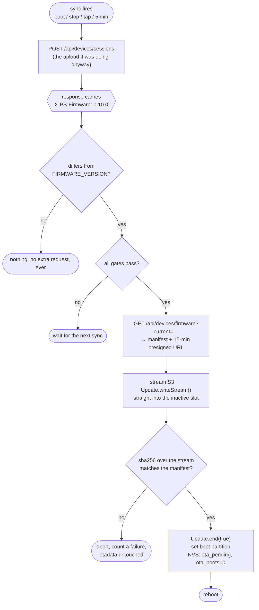
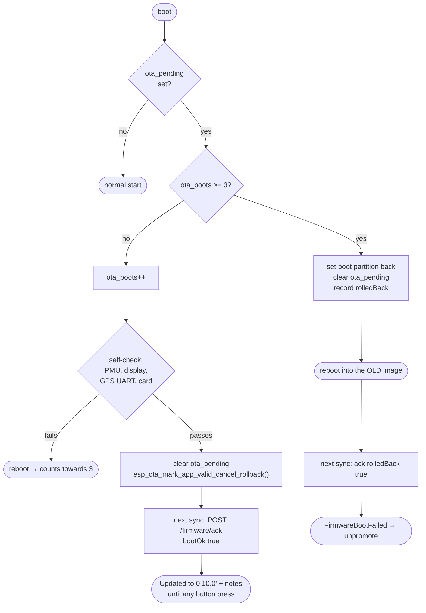
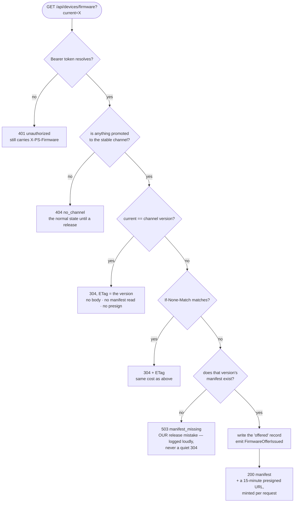
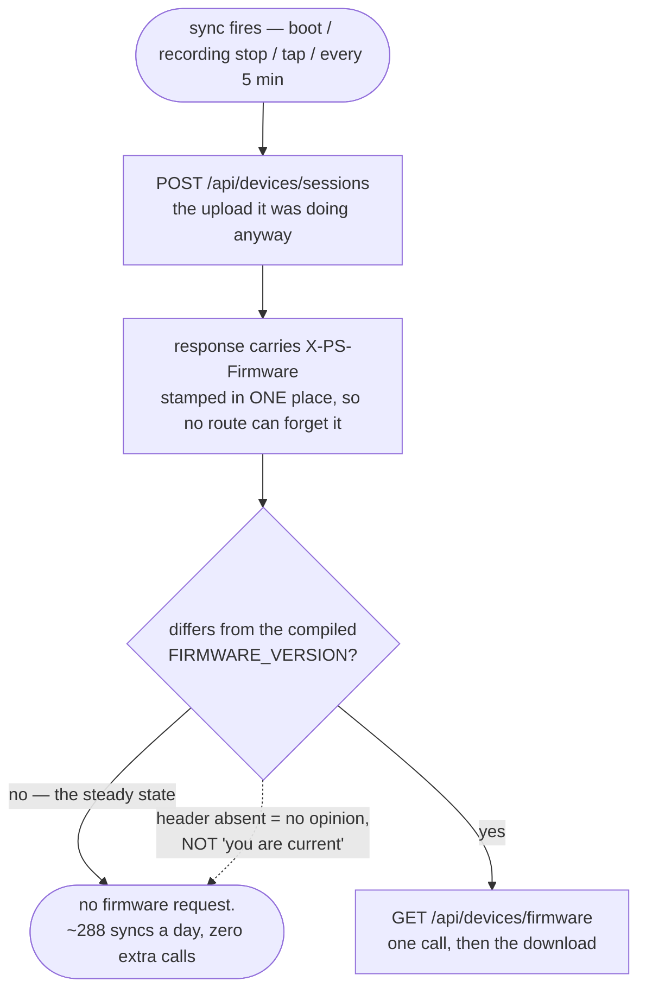

# Device OTA, and how solid the device auth actually is

**Status:** Phase 0 (repartition) **shipped** — #256, 2026-09-19.
**Phases 1, 2 and 4 — the whole server side — shipped 2026-09-19.**
**Phase 3 (firmware) built 2026-09-27 and NOT yet verified on hardware** —
it compiles, all three roles link, the policy is host-tested, and no device has
ever taken an update. The auth review in Part 1 describes what
exists today.
**Owner:** Baldur (product).
**Related:** [`device-uplink.md`](device-uplink.md) (the transport and auth this
reuses), [`device-screen-map.md`](device-screen-map.md) (screens and the error
catalogue), `firmware/docs/device-states-spec.md`.

Two questions that turn out to be one, which is why they share a document: **OTA
is only as safe as the thing that authorises it.** Part 1 is the honest state of
device auth today. Part 2 is the update mechanism, and it depends on Part 1's
weaknesses being addressed in the order given at the end.

> This supersedes and replaces `device-firmware-ota.md`, which existed briefly
> as a separate note. Two documents each half-about OTA is how one of them goes
> stale — and the split had already produced a contradiction: the separate spec
> proposed 3 MB partitions with `spiffs` retained, while what actually shipped
> was 3.9375 MB with `spiffs` removed.

---

## Read this before writing any code

**The partition change is the only irreversible-if-missed item.** A device
flashed with a single-slot table can never receive OTA — `Update.h` only writes
app partitions and the partition table itself is not OTA-updatable.

> **This is done for the one existing device (#256).** It is NOT done for the
> four on order. Every new device needs the two-slot table flashed **by cable
> before it is used in anger**; miss it on one and that device is cable-only for
> life. This is the single thing in this note with a deadline.

**Do not claim something is tested when it was only compiled.** This repo's
firmware has no test harness; verification means flashing and reading the serial
bring-up report. Say which it was.

**Phases are sequential and each one ships independently.** Do not start Phase 2
before Phase 1 is verified on hardware.

---

# Part 1 — how the server authenticates a device today

## The flow

```
device  POST /api/devices/claim   {deviceId, model, firmware}
        → 6-char claimCode (shown on the OLED) + 32-byte claimSecret (kept)
user    enters the code at /profile/me/settings while signed in
        → the claim record gains a userId
device  POST /api/devices/token   {deviceId, claimSecret}   (polls)
        → 32-byte deviceToken, once
device  Authorization: Bearer <deviceToken>  on every upload
```

## What it gets right

- **Nothing reusable is stored.** The claim secret and the device token are kept
  only as `sha256`. The token record is *keyed by* the hash, so a read of the data
  bucket yields hashes of 32 random bytes — not brute-forceable, not replayable.
- **Constant-time comparison** of the claim secret (`hexEqual` → `timingSafeEqual`).
- **Claims are single-use and expire** (10 min), with a consumed *tombstone* so a
  repeat poll gets `410` rather than a misleading "pending".
- **Failures are indistinguishable.** A wrong `deviceId` or secret returns
  `pending`, exactly like a claim that hasn't been approved yet, so the endpoint
  can't be used to probe which device IDs exist.
- **No shared secret in the firmware.** Every device gets its own revocable token,
  so extracting one binary doesn't yield a key to all devices.
- **TLS against a pinned root** (Amazon Root CA 1, `include/root_ca.h`), not
  `setInsecure()` — a rogue CA can't MITM the upload.
- **Device and human auth are separate** (`getDeviceAuth` vs `getAuthUser`): a
  device token cannot satisfy a browser route, or vice versa.

That is a sound design for what it is. The weaknesses below are mostly about what
happens *after* a token exists, and they matter more once OTA is in the picture.

## What it doesn't get right

**1. Tokens never expire and never rotate.** `DeviceTokenRecord` has `createdAt`
and `lastSeenAt`, and nothing reads them for expiry. A token leaked once is valid
until somebody notices and revokes it by hand.

**2. The token sits in plaintext NVS, and there is no flash encryption.** Physical
access to the board → read the flash → recover the token → upload arbitrary
sessions to that user's account. Severity is low (the blast radius is "junk
paddles appear in one account"), but it is unbounded in time because of (1).

**3. `POST /api/devices/claim` is unauthenticated and unthrottled.**
**✅ BOTH FIXED 2026-09-27 — see "Prerequisites 1 and 2" below.** Claims are now
keyed by `deviceId` (redemption is a single read) and both endpoints are rate
limited. The original finding is kept for the record:
   - *Storage/DoS:* unbounded claim records, and `redeemToken` **lists and reads
     every claim** on each poll (`listKeys('device-claims/')`), so the cost of a
     poll grows with the number of outstanding claims. This is the one I'd fix
     first, and it is a performance bug before it is a security one — the fix is
     to key claims by `deviceId` so redemption is a direct read.
   - *Claim-code phishing:* an attacker mints a code and persuades a user to type
     it. The user's account then binds an attacker-controlled "device". The
     existing mitigation is social — the code is shown on the device's own screen,
     so a user should only ever type a code they can physically see — and that is
     worth saying in the UI rather than leaving implicit.

**4. Rate limiting is deferred** (already recorded in CLAUDE.md). The two device
endpoints are unauthenticated, which is exactly where a limit belongs.
**✅ DONE 2026-09-27** — fixed-window limiter, see below.

**5. `resolveDeviceToken` writes on every request** to update `lastSeenAt`. Not a
security issue; a write per API call is worth knowing about before traffic grows.

## Honest summary

For "a hobby tracker uploads GPS traces to one account", the current scheme is
proportionate and the cryptographic hygiene is genuinely good. The gaps that
matter are **non-expiring tokens** and **an unauthenticated, unthrottled, O(n)
claim endpoint**. Neither is urgent. Both become materially more serious the day
the device accepts remote firmware.

---

# Part 2 — OTA

## Why, and the two design choices that shape everything

**Signal, don't probe.** The device already talks to paddlesnitch on a schedule:
sync fires at boot, on recording-stop, on a `sync now` tap, and every 5 minutes
while not recording. Every one of those requests gets a response. So the server
tells the device about new firmware *in responses it was already sending*, and
the device never polls in the steady state. A polling fallback exists only for a
device that has gone a long time without any authenticated exchange.

**Stream to flash, never to the card.** The image is written straight from the
TLS stream into the inactive OTA partition via `Update.writeStream()`. It never
touches the microSD. This is deliberate: the SD and the IMU share one SPI bus and
that bus is the source of this firmware's worst bug class. An OTA that needs the
card would put a multi-megabyte write on the most fragile path in the system.

---

## The shape of it, end to end

Three views. The first is the happy path; the other two are the parts that
decide whether this is safe to point at a device that is not on your desk.

### Signal, download, verify, commit

Note there is **no polling in the steady state** — the version arrives on a
response the device was already going to receive.



### The gates — all must hold

Conservative on purpose: a bricked device on the water needs a cable to recover.


### First boot on the new image — and how it un-does itself

This is the half that matters. Power loss mid-download is safe by construction:
`otadata` is not touched until `Update.end()` succeeds, so an interrupted
download leaves a half-written slot that is simply never booted.



---

## Phase 0 — repartition · ✅ DONE (#256, 2026-09-19)

Shipped, but **not** as sketched below the line. What actually went in:

```
# Name,   Type, SubType,  Offset,   Size
nvs,      data, nvs,      0x9000,   0x5000
otadata,  data, ota,      0xe000,   0x2000
app0,     app,  ota_0,    0x10000,  0x3F0000     3.9375 MB
app1,     app,  ota_1,    0x400000, 0x3F0000     3.9375 MB
coredump, data, coredump, 0x7F0000, 0x10000
```

Two differences from the original proposal, both deliberate:

- **3.9375 MB slots, not 3 MB.** 3.6× the 1.09 MB binary rather than 2.7×.
  Resizing a slot later also needs a cable, so the headroom was worth taking
  while the cable was already attached.
- **`spiffs` is gone.** It was 1.625 MB and *nothing referenced it* — no SPIFFS,
  LittleFS or FFat anywhere in `src/`. Sessions live on the microSD card, which
  is the point of the card. That dead space became app headroom.

**`nvs` kept its offset and size, and this was verified rather than assumed.**
After reflashing, the device still reported `wifi kruttnet`, `joined yes,
previously` and `claimed yes` — credentials and device token both intact, no
re-onboarding. PlatformIO also rewrites `boot_app0.bin` at `0xe000` on a cable
flash, which resets `otadata`, so a stale pointer into the old layout is not a
hazard on this path.

**Proven, not asserted.** `STATUS` and the boot banner both report live state,
so this is checkable on any device instead of inferred from a config file:

```
ota      running=app0 4032KB  target=app1  -> OTA possible
```

Both lines read `OTA IMPOSSIBLE (no second app slot)` before the change, which
is exactly why they exist.

### Still to do for the four devices on order

Flash the two-slot table **by cable, before each device is used**. There is no
second chance: a partition table cannot be changed over the air.

---

## Phase 1 — server: manifest, presigned URL, and the signal · ✅ BUILT

Built as specified, with the differences and additions recorded at the end of
this phase. **Verified by the test suite, not on hardware** — no device speaks
any of this yet.


### 1.1 Storage layout

Firmware artifacts live in the existing data bucket under a prefix that is **not**
publicly readable:

```
firmware/<version>/firmware.bin
firmware/<version>/manifest.json     { version, sha256, sizeBytes, notes, builtAt, gitSha }
firmware/channels/stable.json        { version }          <- the promote pointer
```

`stable.json` is the only thing that decides what devices get. Uploading a build
does not release it; promoting does. See Phase 4.

### 1.2 `GET /api/devices/firmware`

Authenticated with the existing device bearer token (`getDeviceAuth`). Query:
`?current=<semver>`.

- **304 Not Modified** when `current` already equals the channel version, or when
  the client sends a matching `If-None-Match`. No body. This is the common case
  and must be cheap — a single read of `stable.json`, cached.
- **200** with:

```json
{
  "version": "0.10.0",
  "sha256": "<hex>",
  "sizeBytes": 1140528,
  "notes": "Fixes IMU peak window; adds QR onboarding.",
  "url": "https://<bucket>.s3.<region>.amazonaws.com/firmware/0.10.0/firmware.bin?X-Amz-...",
  "expiresInSeconds": 900
}
```

`ETag` on the 200 is the version string, so the device can send `If-None-Match`
on its next request and get a 304 for free.

The presigned URL is generated per request, valid **15 minutes**, GET only, for
that one object. Do not reuse a cached presigned URL across devices — the point of
generating per request is that issuance is the thing being recorded.

**Issuing a 200 writes a record.** See 1.4.

### 1.3 The signal: `X-PS-Firmware`

Every response from a **device-authenticated** route — `/api/devices/sessions`
(all of them, including the per-chunk responses) — carries:

```
X-PS-Firmware: 0.10.0
```

the channel version applicable to that device. Add it in one place in the device
auth middleware so no route can forget it. It costs a header on requests that are
already happening; it is not a new round trip.

The device compares against its compiled `FIRMWARE_VERSION`. Different → set a
pending-update flag in RAM. Same → do nothing, forever, with zero extra requests.

### 1.4 Records

Two records per device per version, both written server-side, both keyed so an
administrator can reconstruct one device's history:

```
firmware-events/<deviceId>/<version>/offered   { at, fromVersion, ip, userAgent }
firmware-events/<deviceId>/<version>/booted    { at, fromVersion, bootOk, resetReason, rolledBack }
```

`offered` is written when a 200 is served. `booted` is written by 1.5.

**TTL: 90 days.** These are troubleshooting records, not an audit trail, and they
are personal data in the sense that they tie a physical device to a user account.
Expire them.

### 1.5 `POST /api/devices/firmware/ack`

Device-authenticated. Body:

```json
{ "version": "0.10.0", "previousVersion": "0.9.0", "bootOk": true,
  "resetReason": "SW_RESET", "rolledBack": false }
```

Writes the `booted` record. Idempotent on `(deviceId, version)` — a device that
retries must not create duplicates. Returns `204`.

### 1.6 Admin access

A single route, `GET /api/admin/devices/:deviceId/firmware-events`, gated on a
**human** admin session (`getAuthUser` plus an admin check — a device token must
not satisfy it). Every access writes its own audit line: who, which device, when.

Do not build a UI for this in Phase 1. A route an administrator can curl is
enough, and the audit line is the part that matters.

---

## Phase 2 — observability · ✅ BUILT (not yet observed)

The EMF lines and the dashboard exist. **No metric has ever been emitted in
production**, because nothing has been promoted and no device asks — so the
dashboard is currently a set of empty charts. That is the correct state.


### 2.1 CloudWatch metrics

Emit **EMF (Embedded Metric Format)** log lines from the Lambda. No separate
metrics API calls.

Metrics, all `Count`:

| Metric | Emitted when |
|---|---|
| `FirmwareOfferIssued` | a 200 manifest is served |
| `FirmwareCheckNotModified` | a 304 is served |
| `FirmwareBootConfirmed` | an ack arrives with `bootOk: true` |
| `FirmwareBootFailed` | an ack arrives with `bootOk: false` or `rolledBack: true` |

**Dimensions: `version` and `model` only.** Never `deviceId` — it is unbounded
cardinality and it turns a metrics bill into a per-device tracking system. The
per-device detail lives in the records from 1.4, behind the admin route.

### 2.2 Dashboard

One CloudWatch dashboard, `paddlesnitch-firmware`, with:

- Offers issued vs boots confirmed, by version, over 30 days. The gap between the
  two lines is the rollout's real completion state.
- Boot failures by version. Any non-zero value here is the signal to unpromote.
- A number widget: devices on each version in the last 7 days.

Define it in the existing `infra/` IaC, not by hand in the console.

---

## Phase 3 — firmware · 🔨 BUILT 2026-09-27, UNVERIFIED ON HARDWARE

`src/ota.{h,cpp}` plus a pure, host-tested `src/ota_policy.{h,cpp}`. **Three
deliberate deviations from what is written below, each caught while building it:**

**1. USB power alone satisfies the power gate.** 3.2 below says
`boardIsCharging() || boardBatteryMv() > 3800`. On a device with **no cell
fitted** — the obvious bench rig — `boardBatteryMv()` returns 0 (it
short-circuits on `!isBatteryConnect()`) and nothing is charging, so that rule
refuses every update forever and the only symptom is silence. `boardOnUsb()`
(`PMU.isVbusIn()`) already existed and is the right signal: wall power does not
brown out during `Update.end()`. There is a host test named after this case.

**2. The self-check does not require the SD card**, though 3.5 lists it. A
missing card is a user action — they pulled it to copy paddles off — not evidence
that the new image is bad, and requiring it would roll a good update back after
three card-less reboots with no explanation. PMU, display and GPS UART are what
indicate the binary came up.

**3. The fallback probe is hourly, not 7-daily** (3.3). The signal is supposed to
ride on requests the device already makes, but `uplinkSyncSessions()` returns
early when the card has no pending files and so makes **no authenticated request
at all** — an idle device receives no header ever, and a bench device with an
empty card could never update, which makes the whole feature untestable. It now
asks outright at most once an hour and **only** when it has heard nothing that
boot; a device that is uploading still costs zero extra requests.

One more thing worth recording because it is easy to miss: **HTTPClient discards
every response header unless you call `collectHeaders()` before the request.**
Without that line the signal silently never arrives and the device falls back to
probing — which is exactly what the design exists to avoid.

Still **not** built: nothing surfaces the running version on the web app's device
page (3.7's last line).


### 3.1 New module: `src/ota.{h,cpp}`

Owned by the **uplink task on core 0**, like every other network operation.
Nothing about OTA runs on core 1. It draws nothing; it publishes into the
existing mutex-guarded `UplinkStatus` and `ui.cpp` renders it.

### 3.2 When the device is allowed to update

All of these must be true. Be conservative; a bricked device on the water is
unrecoverable without a cable.

- A pending-update flag is set (from `X-PS-Firmware`), **or** the fallback probe
  below fired.
- `!storageRecording()` — same rule the uploader already follows.
- WiFi is up and `netcfg.everConnected` is true (this is the home network, not a
  hotspot at a race).
- `boardIsCharging()` **or** `boardBatteryMv() > 3800`.
- This version has not already failed 3 times (see 3.6).

### 3.3 The fallback probe

Only for a device that has had no device-authenticated response for **7 days**
(track `lastServerContactMs` in NVS). Then, and only then, it may call
`GET /api/devices/firmware?current=<v>` with `If-None-Match`, **at most once per
24 hours**. Back off to 72 hours after three consecutive failures.

In the normal case this code path never executes. Log when it does — if it fires
often, the signal in 1.3 is not working and that is the bug to fix.

### 3.4 Download and flash

```
esp_ota_get_next_update_partition(NULL)      -> the inactive slot
Update.begin(sizeBytes, U_FLASH)
Update.writeStream(https stream)             -> 4 KB chunks
Update.end(true)                             -> validates the image
```

- **Verify the sha256 over the stream as it is written**, and abort if it differs
  from the manifest. `Update.end()` checks image structure, not that you got the
  bytes the server meant.
- The presigned URL points at S3, a different host from paddlesnitch.com. TLS must
  still verify against the pinned root in `include/root_ca.h` — S3 chains to
  Amazon Root CA 1, so the existing pin **should** work. Verify this early; if it
  does not, add the correct root rather than reaching for `setInsecure()`.
- `http.setFollowRedirects(HTTPC_STRICT_FOLLOW_REDIRECTS)`.
- Show progress on the OLED: a percentage and a bar, fed the same way the Sync
  screen's `upFile`/`upPart` fields are. A motionless screen during a two-minute
  flash reads as a crash — this firmware has already learned that lesson once.

### 3.5 Power-loss safety

Two layers, because the cheaper one does not cover every case.

**App-level (implement regardless):** before setting the boot partition, write to
NVS `ota_pending = <newVersion>` and `ota_boots = 0`. Early in `setup()`, before
anything else:

- `ota_pending` set and `ota_boots >= 3` → `esp_ota_set_boot_partition()` back to
  the other slot, clear `ota_pending`, record `rolledBack`, reboot.
- `ota_pending` set → increment `ota_boots`, carry on.

On a successful self-check — PMU, display, GPS UART alive, card mounted — clear
`ota_pending` and call `esp_ota_mark_app_valid_cancel_rollback()`. Then send the
ack from 1.5 on the next sync, with `bootOk: true`.

**Bootloader-level:** this only helps if `CONFIG_BOOTLOADER_APP_ROLLBACK_ENABLE`
is set in the prebuilt Arduino bootloader, which it may not be.
**Check whether it is, and report the answer — do not assume either way.** If it
is not enabled, the app-level layer above still covers every failure that reaches
`setup()`; an image that faults before `setup()` would need a cable, and that
limitation should be written down rather than glossed over.

Power lost mid-download is safe by construction: `otadata` is untouched until
`Update.end()` succeeds, so an interrupted download leaves a half-written
inactive slot that is simply never booted. Retry from the start.

### 3.6 Give up rather than loop

Track failures per version in NVS (`ota_fail_<version>`). After 3 failed attempts
at the same version, stop attempting it until the channel offers a *newer* one.
An update that fails forever must not turn into a device that spends every sync
downloading a megabyte.

### 3.7 Telling the user

Two touchpoints, both deliberately small:

- **During:** `Updating 0.10.0` plus a progress bar on the OLED. Button input is
  ignored for the duration; say so on screen.
- **After:** the first boot on a new version shows `Updated to 0.10.0` with the
  one-line `notes` from the manifest underneath, until any button press dismisses
  it. This is the whole point of surfacing it — a user who knows something changed
  can tell you when something breaks.

Also add a line to the device's page in the web app: current version, when it
updated, and the notes. That is where someone will look after noticing a change.

---

## Phase 4 — GitHub Actions · ✅ BUILT (never yet run)

`.github/workflows/firmware-release.yml`. **It has not executed once** — it
fires on a push to `main` touching `firmware/**`, which this branch will be, so
its first real run is the merge that ships it. Watch that run.


New workflow `.github/workflows/firmware-release.yml`. **Build on merge, release
on a human action** — these are two separate things and conflating them means a
bad commit reaches every device.

**On push to `main` touching `firmware/**`:**

1. `pio run -e tracker`
2. Compute sha256, read the version (see below)
3. Upload `firmware.bin` and `manifest.json` to `firmware/<version>/`
4. Do **not** touch `channels/stable.json`
5. Comment the version and size on the commit

**On `workflow_dispatch` with a version input:**

1. Verify `firmware/<version>/` exists
2. Write `channels/stable.json`
3. Post the release to wherever you want to see it

Use OIDC for AWS credentials, not a long-lived access key in secrets.

**Version is currently a `-DFIRMWARE_VERSION` string literal in
`platformio.ini`,** which will drift from git the first time someone forgets —
and it already has. It has read `0.9.0` across every change merged on
2026-09-19, including several that changed device behaviour.
Make one source of truth: a `firmware/VERSION` file read by both the build flag
and the workflow, and fail the build if `VERSION` is unchanged from the previous
commit on `main` while `firmware/src/**` changed.

---

## What actually shipped on the server (2026-09-19)

Deviations and additions against the spec above, so the next person does not
have to diff the code to find them.

### The server flow, as built

The three diagrams higher up are **design** sketches, and two of them describe
firmware that does not exist yet. This one is the server as it actually is, and
is the one to review if you want to know what a device will meet today.



### How traffic is kept down — and it is not mainly the 304

There are three layers, and they are worth separating because the first one does
almost all the work:

**Layer 1 — the signal. It removes the request entirely.** `X-PS-Firmware` is
stamped on every device-authenticated response by `withDeviceAuth`, so the device
compares versions locally against something it was already receiving. A device
that is up to date makes **no firmware request at all, ever** — not a cheap one, none.



**Layer 2 — the 304, for when it does ask.** A device that asks anyway (it raced
a promotion, or retried after a failed download) gets `304` with the version as
its `ETag`, so its next `If-None-Match` is answered without reading a manifest or
signing a URL. No body either.

**Layer 3 — the channel read is cached 60 s in-process.** This is what makes
Layer 1 affordable: the header would otherwise cost a storage read on every one
of the ~48 chunk responses in a single sync. `promoteFirmware` drops the cache, so
a rollback is not delayed by it.

### The honest caveat: a 304 is not free

Worth knowing before anyone leans on the 304 as the saving. **Every**
device-authenticated request — a 304 included — costs one storage **read plus one
write**, because `resolveDeviceToken` bumps `lastSeenAt` on every call:

| Response | Auth read | Auth write | Manifest read | Presign |
|---|---|---|---|---|
| `304` | yes | yes | no | no |
| `404 no_channel` | yes | yes | no | no |
| `200` | yes | yes | yes | yes |

So the 304 saves the manifest read, the signature and the body — but the auth
write dominates it either way. That per-request write is **Part 1 weakness 5,
still unfixed**, and it is the thing to attack if device traffic ever actually
costs money. Layer 1 is what keeps that from mattering: the request does not
happen at all.


**`firmware/VERSION` is now the single source of truth**, read by
`firmware/scripts/version.py` (a PlatformIO `pre:` script on `[hw]`, so every
board environment gets it) and by the release workflow. The literal in
`platformio.ini` is gone. Set to **0.10.0** — it had been `0.9.0` across every
behaviour change merged on 2026-09-19, which the server would have read as
"already current". Proven rather than assumed: `strings firmware.bin` contains
`0.10.0` and no `0.0.0-dev`, so the `#ifndef` fallback is not what is compiling
in.

**Publishing refuses to overwrite.** Once `firmware/<version>/firmware.bin`
exists the build job fails rather than replacing it. Some device may already be
running those bytes; changing them under the same version number makes every
record of that version a lie.

**Promoting verifies the image exists** (`promoteFirmware` checks both the
manifest and the binary, and so does the workflow). A channel pointing at
missing bytes would turn every device's next sync into a failed download.

**The channel read is cached in-process for 60 s.** `X-PS-Firmware` goes on
every device-authenticated response including each of ~48 chunk responses in one
sync, so an uncached read would be a storage call per chunk. The cost is that a
promotion takes up to 60 s to reach a warm Lambda container — irrelevant against
a 5-minute sync interval. `promoteFirmware` drops the cache, so a rollback is
not delayed by it.

**`withDeviceAuth` (`apps/web/src/lib/device-route.ts`) is new** and is how the
signal is guaranteed. The spec says "add it in one place in the device auth
middleware"; there was no such middleware — each route called `getDeviceAuth`
itself. The upload route returns from **fourteen** places, so the header is
stamped by the wrapper rather than by any of them. It is stamped on errors and
on the 401 too: a device that is failing or re-claiming is exactly one that
should still learn a new version exists.

**No header at all when nothing is promoted.** An absent `X-PS-Firmware` means
"no opinion", not "you are current" — the firmware must not act on its absence.

**A 15-minute presigned URL, and a dev equivalent.** There is no S3 in local
dev, so `presignGetUrl` returns a same-origin URL to
`/api/devices/firmware/download` carrying an HMAC over (key, expiry). The
contract the device sees is identical either way — no credentials, one object,
expires — which is what makes the flow testable end to end without AWS. That
route refuses to run at all outside dev, and refuses any key that is not a
firmware image even with a valid signature.

**Platform admin is a new concept** (`apps/web/src/lib/admin.ts`): an env
allowlist of Cognito `sub`s, `ADMIN_USER_IDS`. Not group-admin, which is about
one club's courses. Deliberately not a flag in storage — no route can grant it,
so escalating requires a deploy. **Unset means nobody.** It is passed through
`deploy.yml` from a repository *variable*; forgetting that would silently blank
the allowlist on the next deploy.

**The admin route is not in `proxy.ts`.** It is an API meant to be curled, and a
307 to a sign-in page is a worse answer than 401/403 JSON. The route's own
`getAuthUser` + `isPlatformAdmin` check is the gate, and there are tests for
signed-out, signed-in-non-admin, unset-allowlist, and a device token (which must
never satisfy it).

**A rollback is never recorded as a successful boot**, whatever the device
claims — `bootOk` and `rolledBack` are independent fields on the wire and a
firmware bug could set both.

### Not done, and deliberately

- **Phase 3 (firmware).** Nothing on a device does any of this.
- **Prerequisites 1–3** (key claims by `deviceId`, rate-limit the unauthenticated
  device endpoints, token expiry/rotation). The spec says to do at least the
  first two *before promoting anything to stable*. That remains true and nothing
  here changes it — see the gate below.
- **Image signing.** Still the proper fix, still a follow-up.

### The gate before the first promotion

Building this does not make it safe to use. Before `channels/stable.json` is
ever written for real:

1. ~~Prerequisites 1 and 2 above.~~ **✅ done 2026-09-27.**
2. Phase 3, including verification item 4 — deliberately ship a broken image and
   confirm the rollback fires.
3. Confirm the bucket policy allows writes to `firmware/` only from the release
   workflow's OIDC role. Today the workflow reuses the deploy role, so anything
   that can deploy can also release.
4. Add a required reviewer to the `firmware-release` GitHub Environment. A
   workflow referencing an environment that does not exist **auto-creates it with
   no protection rules**, so the promote gate is nominal until someone sets one.

---

## Prerequisites 1 and 2 — shipped 2026-09-27

Both were the stated gate before anything may be promoted to `stable`, and both
were worth doing on their own merits.

### 1. Claims are keyed by `deviceId`

`device-claims/{deviceId}.json`, plus a `device-claim-codes/{code}.json ->
{deviceId}` index for the browser half (the user types a code; the device never
knows its own code).

**The scan it removes was the real cost.** The device polls `/api/devices/token`
every 5 seconds for up to five minutes, and `redeemToken` used to `listKeys` the
whole claim prefix and read every record on *each* of those ~60 polls. Onboarding
one device therefore got slower as anyone's outstanding claims accumulated, on an
unauthenticated endpoint. It is now a single direct read.

**A second property falls out, and it is the one to remember: a device can only
have ONE outstanding claim.** A new claim supersedes the previous one. That
bounds storage under a flood, and it kills the old code:

- `createClaim` deletes the superseded code's index entry.
- `linkClaim` additionally verifies `claim.claimCode === code` after resolving
  the index. Without that check a stale index entry would bind whatever claim the
  device holds *now* — someone who saw an earlier code could type it and capture
  a later claim. Belt and braces, because an interrupted write must not open it.
- Redeeming deletes the code index, so a spent code resolves to nothing.

**No migration.** Claims live 10 minutes, so any in flight at deploy time is
simply lost and the device re-claims on its next attempt. Writing a migration for
a 10-minute-lived record would be more risk than the thing it protects.

**This changed one existing test, legitimately.** `devices.test.ts` created two
claims *for the same device* to get two simultaneously-live claims; with
per-device keying the second supersedes the first, so it now uses two devices.
The superseding behaviour got its own tests rather than being absorbed silently.

### 2. Rate limits — and why the spec's number was wrong

`packages/core/src/rate-limit.ts`: a fixed-window counter in the object store.
Limits in `apps/web/src/lib/device-limits.ts`.

| Endpoint | Limit |
|---|---|
| `/api/devices/claim` | 10/hour per `deviceId`, 30/hour per IP |
| `/api/devices/token` | 300/hour per `deviceId` |

**Part 1 item 4 suggested 30/hour per device on `/token`. Applying that would
have broken onboarding.** `uplinkClaim()` (`firmware/src/uplink.cpp`) polls on a
`delay(5000)` loop for `timeoutMs`, default `300000` — so **one legitimate claim
attempt is ~60 requests in five minutes**. A 30/hour cap cuts the device off two
and a half minutes into its own five-minute window, and it would have presented
as *"claim code expired"*: a self-inflicted bug that costs an afternoon to find.
300/hour is five full rounds, derived from that measured rate, and there is a
test that replays a full 60-poll round.

Deliberate choices, all with a reason:

- **Validation before the limiter**, on both routes, so a malformed `deviceId`
  cannot spend a real device's allowance and the limiter's storage key is always
  a validated 8-hex string.
- **A bad `deviceId` on `/token` still answers `202 pending`**, not a distinct
  error — that endpoint's whole design is that no response reveals whether a
  device or secret is real.
- **No per-IP limit on `/token`**: 60 polls per round means any IP cap low enough
  to matter is lower than two devices onboarding behind one router.
- **No IP header → per-device limit only.** A shared `unknown` bucket would make
  every device in local dev compete for one allowance.
- **Only the first `x-forwarded-for` entry** is used; the rest are caller-supplied
  and trivially spoofed.
- **429 + `Retry-After`.** The firmware does not read it today (it treats any
  unexpected status as retry, which is the right default), but a limiter that
  cannot say when to come back is one nobody can integrate against.

Two limitations, stated rather than discovered later:

- **The increment is not atomic.** No compare-and-swap in the storage layer, so
  parallel requests can lose a write and an attacker undercounts. A serial poller
  — which is what the device is — counts exactly. Precise accounting needs
  DynamoDB conditional writes or ElastiCache, the "real store" this spec defers
  to. This is a speed bump for cost and storage, **not** a WAF, and not a
  brute-force defence: the claim secret is 32 random bytes, so guessing it was
  never the threat.
- **It fails OPEN.** A storage error allows the request. Being locked out of
  onboarding by a transient S3 blip is worse than serving one extra request.
  There is a test for this, and it was mutation-checked — flipping it to fail
  closed makes the test fail.

Counters live under `rate/` with a **1-day bucket lifecycle rule** (windows are
one hour; nothing deletes them inline because a delete would cost more than the
object it removes).

---
## Security: what this spec does and does not give you

It does **not** include image signing. The device trusts the manifest because it
arrived over TLS pinned to Amazon Root CA 1 with a bearer token, and trusts the
binary because its sha256 matches that manifest. That is a real improvement over
nothing and it is proportionate to a handful of devices.

The residual risk, stated plainly so it is not discovered later: **anyone who can
write to `channels/stable.json` or to the firmware prefix can run arbitrary code
on every device.** Bucket policy should therefore allow writes only from the
release workflow's OIDC role. Signed images (ESP-IDF supports them without full
secure boot) are the proper fix and belong in a follow-up spec.

The prerequisites in **Prerequisites, in order** below — keying claims by `deviceId`,
rate-limiting the unauthenticated device endpoints, token expiry and rotation —
become materially more important the day a device accepts remote firmware. Do at
least the first two before promoting anything to `stable`.

---

## Prerequisites, in order

In this order, because each one is a prerequisite for the next being worth doing:

1. ~~Key claims by `deviceId` (kills the O(n) scan).~~ **✅ done 2026-09-27.**
2. ~~Rate-limit the two unauthenticated device endpoints.~~ **✅ done 2026-09-27.**
3. Expiry + rotation for device tokens. **Still open** — the next one.
4. Signed images.
5. ~~Repartition + A/B~~ — **done, #256.** See Phase 0.

Steps 1–3 are worth doing on their own merits whether or not OTA happens.

**Step 5's partition change jumps the queue for any device being built or handed
over**, because it is the only item on this list that stops being possible
later. Ship a device on a single-slot table and it is cable-only for life.

Done for the existing device (#256). **Not done for the four on order** — each
needs the two-slot table flashed by cable before use. With it in place every
other step stays open, in whatever order and whenever they are actually needed;
the empty `app1` slot costs nothing but flash that was 83% unused.

---

## Verification

**Phase 0 — ✅ done and verified on hardware (2026-09-19).** Flashed; `STATUS`
reported `wifi kruttnet`, `joined yes, previously` and `claimed yes`, so the
token and SSID survived; running partition `app0` with `app1` as the target:

```
ota      running=app0 4032KB  target=app1  -> OTA possible
```

Not yet done for the four devices on order.

**Phase 1–2:** 304 on a current device; 200 with a working presigned URL on a
stale one; the URL 403s after 15 minutes; both records appear; the admin route
returns them and writes an audit line; a non-admin session gets 403; metrics
appear on the dashboard with no `deviceId` dimension.

**Phase 3, on hardware, each stated separately as verified or not:**

1. Signalled update: server promotes, device picks it up on its next sync
   without any extra request before the signal.
2. Full cycle: download, sha256 verified, flash, reboot, self-check, ack with
   `bootOk: true`, `Updated to X` on screen.
3. **Pull the USB cable mid-download.** Device must boot the old firmware
   unchanged and retry later.
4. **Deliberately ship a broken image** (e.g. one that returns early before the
   self-check) and confirm the app-level rollback fires after 3 boots and the ack
   reports `rolledBack: true`.
5. Battery gate: with no charger and a low cell, no update is attempted.
6. Recording gate: an update is never attempted mid-session.

Item 4 is the one that is tempting to skip and the one that decides whether this
is safe to point at a device that is not on your desk.

---

## Open questions

- **Is OTA actually worth it?** With one device on a cable, no — a flash takes 13
  seconds. With several in other people's hands, yes, and that is now the stated
  direction. The thing to separate is the *mechanism* from the *prerequisite*: the
  mechanism can wait until there is something to update and someone to update it
  for; the repartition cannot wait past the first device you hand over. Do the
  cheap irreversible-if-missed part now, build the rest when it is needed.
- **Flash encryption and secure boot?** They close the physical-access hole, and
  they make a bricked device genuinely unrecoverable if the keys are mishandled.
  Not for a single hand-built unit.
- **Should the claim UI say "only type a code you can see on your own device"?**
  Cheap, and it is the actual mitigation for claim-code phishing.
