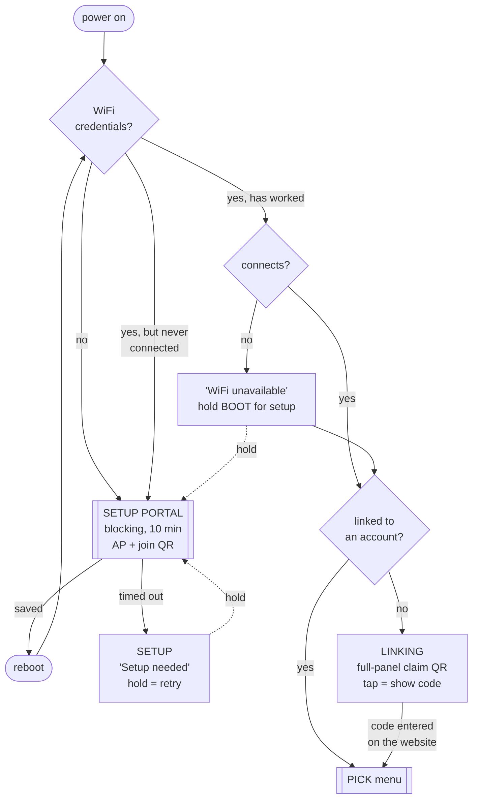
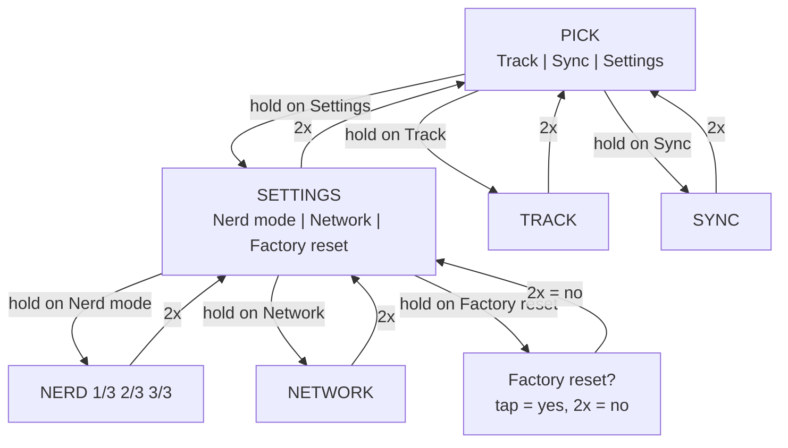
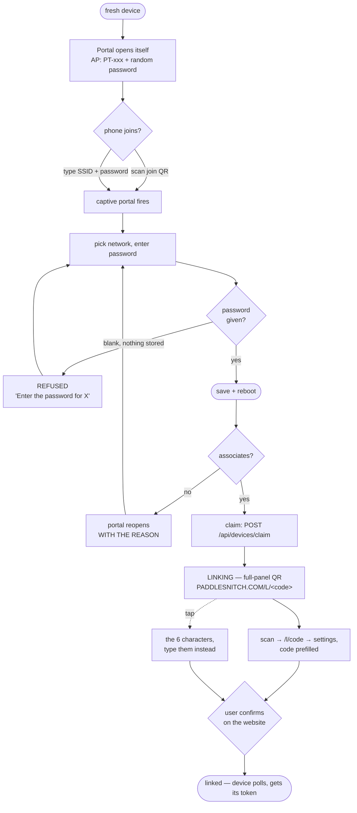

# Device screen map, and everywhere a customer can get stuck

**Status:** reference. Written 2026-09-19, from firmware 0.9.0 as merged.
**Purpose:** two things — every screen and how you reach it, and a catalogue of
failure states with what the customer actually sees.
**Source of truth for behaviour:** `firmware/docs/device-states-spec.md` (screens
and gestures) and the code. This file is the map over the top, and the place
error cases are collected.

Diagrams are Mermaid, so they render in GitHub without tooling.

---

## The gesture contract

One button (GPIO0). `RST` is the AXP2101 power key and cannot be used as input.
Each gesture means the same thing on every screen — that is the whole design,
and every exception that has crept in has been a bug.

| Gesture | Means |
|---|---|
| **tap** (<400 ms) | move / cycle within this screen. Never acts, never destroys, always wraps. |
| **hold** (1200 ms) | select, or commit this screen's primary action. |
| **double-tap** | back one level. Always, cancelling any pending confirmation on the way. |

The one place `tap` commits is a confirmation, and every confirmation says so on
the panel. A tap is dispatched ~400 ms after release (the double-tap window)
**except on Pick**, which has no double-tap action and so acts immediately.

---

## Top level: which screen, and why

The state is derived, not stored — `netHasWifi()` and `netIsClaimed()` decide
whether the device is usable at all, and a confirmation outranks everything.



**Confirmations outrank the screen underneath** — `ResetConfirm` and
`DeleteConfirm` are drawn instead of whatever was showing.

---

## The menus



Nerd mode and Network sit under Settings so the top level stays the three things
you touch on the water. `tap` wraps in every menu and on every paged screen.

---

## Onboarding — the highest-risk path

This is where a new owner meets the device, and where every failure found on
2026-09-19 lived.



---

## Screen reference

| Screen | Shows | tap | hold | double-tap |
|---|---|---|---|---|
| **Setup** | `Setup needed`, hold BOOT | — | open the portal | — |
| **Portal** (blocking) | join QR + SSID / password / IP | *(no button input — it is a web flow)* | | |
| **Linking** | full-panel claim QR | QR ↔ the 6 characters | — | — |
| **Pick** | Track / Sync / Settings | move highlight | open | — |
| **Settings** | Nerd mode / Network / Factory reset | move highlight | open, or arm the reset | → Pick |
| **Track** | speed, SPM, distance, `● REC` | cycle speed unit | arm `STOP?` | → Pick |
| **Sync** | on device / uploaded / pending, live progress | page: status ↔ cleanup | p1 sync now · p2 arm delete | → Pick |
| **Nerd** `1/3` | gnss+session / power+system / radio+storage | next page, wraps | radio page: re-link | → Settings |
| **Network** | SSID, IP, RSSI, connection state | — | open the WiFi portal | → Settings |
| **Confirmations** | what will happen | **yes** | — | **no** |

---

## Error catalogue

What the customer sees, what it means, and whether the device tells them enough
to act. **This is the part worth reviewing.**

### Onboarding and network

| What they see | What it means | Does the device explain? |
|---|---|---|
| `Enter the password for "X"` | Blank password submitted with nothing stored | ✅ and it refuses to save |
| `Found "X" but couldn't join it — the password is probably wrong.` | Associated, PSK rejected (`4WAY_HANDSHAKE_TIMEOUT`) | ✅ reason carried into the portal form |
| `Can't see "X". Names are case-sensitive, and this device only supports 2.4 GHz networks (not 5 GHz).` | SSID not in a scan | ✅ names the two usual causes |
| `Couldn't join "X". Check the name…` | Failed and the scan was inconclusive | ✅ honest about not knowing |
| `WiFi unavailable` / `Hold BOOT for setup` | Credentials that HAVE worked failing now — away from home | ✅ and deliberately does **not** hijack into setup |
| `Setup needed` / `Hold BOOT` | Portal timed out after 10 min with nothing saved | ✅ route back is a hold |
| `wifi: check password` on Linking | SSID stored, never connected | ✅ since #263; was `getting a code...` |
| `getting a code...` | Connected, claim request in flight | ✅ |
| `....` on Linking | Claim has not returned a code yet | ⚠️ ambiguous — see gaps |

### Recording and storage

| What they see | What it means | Does the device explain? |
|---|---|---|
| `Acquiring GPS...` | Track open, no fix yet; recording is waiting | ✅ |
| `NEED GPS` (toast) | Manual record attempt before a fix | ✅ refuses rather than making a junk file |
| `No SD card` | Card missing or failed to mount | ✅ |
| `BUSY` (toast) | Uploader holds the card; recording cannot start | ✅ retry works |
| `!N ROWS LOST` on Track | Track rows dropped to a busy SPI bus | ✅ and it displaces the hint, because it matters more |
| `scanning card...` | Sync screen before the first directory scan | ✅ |
| `imu FAILED` (Nerd 3/3) | IMU did not initialise — usually the warm-reset wedge | ⚠️ only on a diagnostics page |

### Upload

| Condition | Device behaviour | Customer-visible? |
|---|---|---|
| `202` per chunk | normal; progress bar advances | ✅ `<file> n/N` + bar |
| `201` on the last chunk | assembled and parsed | ✅ counts move |
| `409` on a sidecar | its track is not up yet — retried next sync, correctly | ⚠️ invisible |
| `409 already_uploaded` | duplicate filename; server has it | ❌ **retried every sync, forever** |
| `422` | server could not use the file (fix-less rows, no motion rows) | ❌ **retried every sync, forever** |
| `sha256` mismatch | assembled bytes wrong — `422` | ❌ same, and indistinguishable |
| no WiFi at sync time | retried in 5 min | ✅ Sync screen shows pending |

---

## Gaps — where a customer can still get stuck

Honest list. Nothing here is fixed.

1. **A permanently-rejected file is retried forever, and this is a regression.**
   `uploadOne()` — the pre-chunking path — got this right:

   ```c
   bool done = (rc == 200 || rc == 201 || rc == 422 || (rc == 409 && !retryOn409));
   if (done) markUploaded(name, rc);
   ```

   A `422` meant *the server will never accept this*, so it was recorded and
   dropped. `uploadChunked()`, which replaced it and now handles **every**
   upload, treats anything that is not `201`/`202` as a transient failure:

   ```c
   if (rc != 202 && rc != 201) { ok = false; break; }   // -> markUploaded never runs
   ```

   So a file the server has permanently rejected — fix-less rows, no motion
   rows, a sha mismatch — is re-uploaded **in full, on every sync, forever**.
   Same for a `409 already_uploaded` if `uploaded.txt` ever loses an entry. On a
   2.4 MB sidecar that is minutes of radio and a chunk of battery every five
   minutes, and nothing on the device or the website ever says so.

   `uploadOne()` still contains the correct logic and is **dead code** — nothing
   has called it since chunking landed, which is exactly why the regression was
   invisible.

   *The fix is small — distinguish permanent from transient in `uploadChunked`
   and call `markUploaded` for the permanent ones — but it changes upload
   behaviour, which is the most fragile area in this firmware, so it is written
   down here rather than changed unsupervised.*
2. **`....` on the Linking screen is ambiguous.** It now distinguishes a WiFi
   problem, but a claim that fails for any other reason (server error, expired
   claim, clock skew) looks identical to one still in flight.
3. **Claim expiry is not surfaced.** Claims last 10 minutes. A device left on the
   Linking screen past that shows the same code, which will no longer work.
4. **A full SD card is not surfaced anywhere.** 244 GB makes it unlikely, but the
   failure would present as recording silently not working.
5. **Nothing shows the last upload error.** The Sync screen has counts; a
   persistently failing upload looks the same as a slow one.
6. **`imu FAILED` only appears on Nerd 3/3.** A dead IMU costs the motion sidecar
   — no cadence, no attitude — and the user finds out when the analysis is
   missing, not when it happens.
7. **Android is untested** for both QR codes. The join payload is a standard
   `WIFI:` string, so there is no particular reason to expect trouble, but that
   is an expectation, not a test.
8. **The portal has no route back other than waiting.** 10 minutes is a long time
   if you opened it by accident; `double-tap` does nothing there because the
   portal blocks the button loop entirely.

### Fixed on 2026-09-19, listed so they are not re-introduced

- Blank password saving an empty password on a fresh device (#263)
- A device with wrong credentials never reopening the portal (#263)
- The claim code never reaching the screen — published after the poll it was
  needed for (#262)
- The claim QR crowded by text, measurably worse than the same payload centred
  (#262)
- Code and QR flickering, two cores drawing to one display (#264)
- `2x=next` on Nerd, left over from when double-tap paged (#264)

---

## Web side

| Route | Purpose | Failure the customer meets |
|---|---|---|
| `/L/:code` → `/l/:code` | claim QR target; uppercase for QR alphanumeric mode | wrong case 404s without the redirect |
| `/l/:code` | → `/profile/me/settings?code=…#devices` | relative redirect, so it cannot leak the Lambda origin |
| `/profile/me/settings` → Devices | enter or confirm the code | `unknown_code` / `claim_expired` / `already_linked` are all worded for a human |
| `/profile/me/devices` | per-device data + diagnostics | — |
| `/profile/me/devices/[sessionId]` | motion charts for one session | `No motion data for this session yet` when no sidecar |
