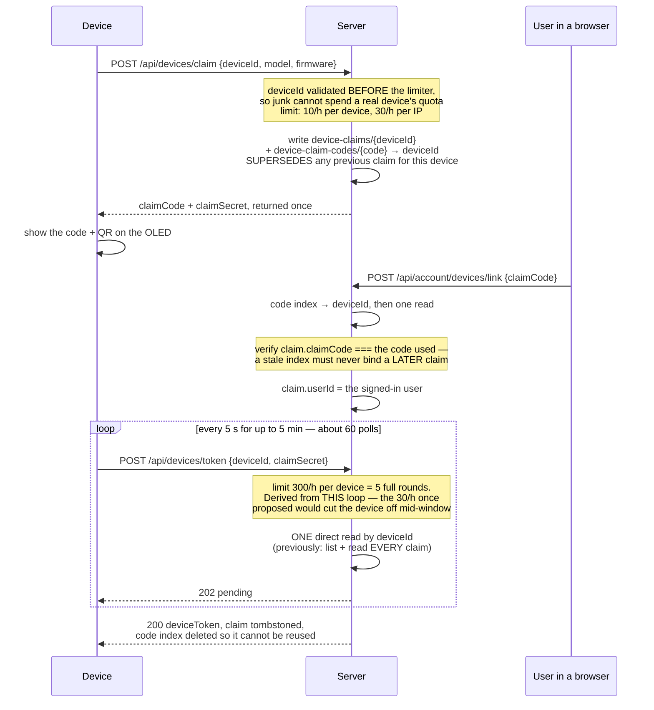

# Feature spec: hardware tracker uplink (device claim + session upload)

**Status:** ✅ **shipped 2026-09 (#214/#215/#216)** — both sides. Since then the transport changed substantially: **every upload is chunked** (`?part=N&parts=M&sha256=`). See the Devices section of `CLAUDE.md` and [`device-screen-map.md`](device-screen-map.md).
**Owner:** Baldur (product). App: `apps/att` (platform-level routes, served at the root).
**Counterpart:** the `gps_device` repo — LilyGO T-Beam S3 Supreme firmware, device
id `5A43CA48`. This document is the contract between the two; keep them in step.

## Why

The tracker records paddle sessions to microSD as CSV at 1 Hz and has WiFi. It
should upload a finished session to paddlesnitch the way any other trace arrives —
without a phone app in the middle, and without a human copying files off a card.

Two things stop it doing that today:

1. **Auth is browser-shaped.** `getAuthUser()` reads the `tt_id` cookie from a
   Cognito session. A headless device has no cookie and no browser to obtain one.
2. **Nothing binds a device to an account.** There is no notion of device identity.

## Settled decisions

### No new parser — the device conforms to the existing CSV shape

`packages/timing/src/csv.ts` already looks for `lat`, `lon`/`lng` and
`time`/`timestamp`/`datetime`/`date` columns. The firmware now emits a
`timestamp` column in ISO 8601 UTC alongside `lat`/`lon`, so **`parseTrace()`
handles the device's file unchanged**.

No `looksLikeTBeam()` sniffer, no device-specific parser, no new branch in
`parse.ts`. This was deliberate: it was cheaper to change the firmware than the
platform, and it means the file is equally readable by any other tool.

> **Null Island.** Rows without a GPS fix previously wrote `0.0000000,0.0000000`.
> That is a *valid* coordinate, so `parseCsv` would have accepted it and injected
> false points into every track. The firmware now writes **empty** `timestamp`,
> `lat` and `lon` on unfixed rows, which the parser skips. If the device format
> is ever changed, preserve this.

Columns after `tx_seq` (IMU, battery, HDOP, satellite count) are ignored by the
parser and carried only for diagnostics.

### The user never types a secret into the device

The device has a 128×64 OLED and no keyboard. So the binding runs the other way:
the device displays a short code, and the user enters it on the website while
signed in. This is the standard TV/console pairing flow.

**No credential is compiled into the firmware.** A shared API key in a binary can
be read off the flash of any device that has one; each device instead holds a
token it was individually issued and that can be revoked individually.

### Device identity

`deviceId` is 8 uppercase hex characters — the low 32 bits of the ESP32 efuse
MAC (`5A43CA48`). Stable across reflashes, and the same id the firmware uses as
its LoRa node id. It is **not** a secret: it is visible in every LoRa packet, so
it authenticates nothing on its own.

## Endpoints

Platform-level (`apps/att/src/app/api/devices/*`), reachable at the root because
CloudFront's default behavior routes everything except `/analyse*` to att.

### `POST /api/devices/claim` — unauthenticated

Starts a claim. Called by the device.

```jsonc
// request
{ "deviceId": "5A43CA48", "model": "lilygo-tbeam-s3-supreme", "firmware": "0.3.0" }
// 200
{ "claimCode": "K7P2QM", "claimSecret": "<32 bytes base64url>", "expiresAt": "2026-09-05T16:10:00Z" }
```

- `claimCode`: 6 chars from `23456789ABCDEFGHJKMNPQRSTVWXYZ` — no `0/O`, `1/I`,
  `U/V` confusions, because it is read off a small mono display and typed by hand.
- `claimSecret`: high-entropy, returned **once**, held only by the device. Knowing
  the visible code is therefore not enough to collect the token.
- TTL **10 minutes**, single use.
- Rate limit by IP and by `deviceId` (see Abuse).

Stored at `device-claims/{claimCode}.json`:
`{ claimCode, claimSecretHash, deviceId, model, firmware, createdAt, expiresAt, userId? }`

### `POST /api/devices/token` — unauthenticated, polled

The device polls this every 5 s until the user enters the code.

```jsonc
// request
{ "deviceId": "5A43CA48", "claimSecret": "…" }
// 202 — code not yet entered
{ "status": "pending" }
// 200 — bound
{ "deviceToken": "<opaque>", "userId": "…", "deviceName": "Baldur's tracker" }
// 410 — expired or already consumed
{ "error": "claim_expired" }
```

Verify `claimSecret` against the stored hash **before** revealing anything, and
in constant time. On success: mint the token, delete the claim record, and write
the device record. The claim is consumed — a second call returns 410.

### `POST /api/account/devices/link` — authenticated (browser)

The other half, called from `/profile/me/settings`.

```jsonc
{ "claimCode": "K7P2QM", "name": "Baldur's tracker" }   // → 200 { deviceId, model }
```

Sets `userId` on the claim record. Errors: `404 unknown_code`,
`410 claim_expired`, `409 already_linked`.

### `GET` / `DELETE /api/account/devices` — authenticated (browser)

List the signed-in user's devices; revoke one. Revocation deletes the token
record — the device then gets 401 on its next sync and falls back to claiming.
It deletes the device's *metadata* too, but **not its uploaded sessions**, which
is why MY DEVICES still shows a revoked tracker (flagged `not linked`).

The GET projects an explicit field set — `deviceId`, `name`, `model`,
`firmware`, `linkedAt`, `lastSeenAt` — rather than serialising `DeviceRecord`
whole. `DeviceRecord.tokenHash` is sha256 of the device bearer token: it lets
the owner revoke server-side and authenticates nothing in a browser, so it does
not go over the wire. Regression test in `apps/web/src/tests/devices.test.ts`.

### Pairing, end to end

Worth a picture because the storage keying changed on 2026-09-27 and the rate
limits are derived from the poll loop drawn here.



Every miss on the `/token` path — unknown device, wrong secret, superseded claim
— answers `202 pending`, identical to "the user has not typed the code yet", so
nothing here reveals whether a device or a secret is real.

### `GET /api/devices/firmware?current=<semver>` — device token

The OTA manifest. `304` (ETag = the version) when the device already runs the
promoted version or sends a matching `If-None-Match`; `404 no_channel` when
nothing has been promoted, which is the normal state; `200` with
`{version, sha256, sizeBytes, notes, url, expiresInSeconds}` otherwise. The
`url` is a 15-minute presigned GET for that one image, generated per request —
issuance is what gets recorded, so a URL is never shared between devices.

**This is not the steady-state path.** A device only calls it after
`X-PS-Firmware` told it there is something new.

### `POST /api/devices/firmware/ack` — device token

`{version, previousVersion, bootOk, resetReason, rolledBack}` → `204`.
Idempotent on (deviceId, version): the ack rides on a sync and a sync can fail,
so a retry must not double-count a boot failure. A `rolledBack` device is never
recorded as a successful boot regardless of what `bootOk` says.

### `X-PS-Firmware` — on every device-authenticated response

The version the stable channel points at, stamped by `withDeviceAuth`
(`apps/web/src/lib/device-route.ts`) on **every** response from a device route,
including errors, the 401, and each of the ~48 chunk responses in one sync.

This header is the entire OTA signal: the device compares it against its
compiled `FIRMWARE_VERSION` and, in the steady state, makes no firmware request
ever. **The header is absent when nothing is promoted** — absent means "no
opinion", NOT "you are current".

### `POST /api/devices/sessions?filename=track_0005.csv` — device token

```
Authorization: Bearer <deviceToken>
Content-Type: text/csv
```

Body is the raw CSV, streamed from the SD card (a session is typically 5–500 KB;
cap at **2 MB**). Not multipart: assembling multipart on the device costs heap it
does not have, and this endpoint has no existing convention to match.

| Status | Meaning | Device behaviour |
|---|---|---|
| `200`/`201` | accepted | mark uploaded |
| `409` | already have this `deviceId`+`filename` | mark uploaded |
| `422` | parsed, but no usable track points | mark uploaded — stops re-uploading indoor sessions forever |
| `401` | token unknown or revoked | discard token, re-claim |
| `413` | over the size cap | mark uploaded, log |

```jsonc
// 200
{ "sessionId": "…", "points": 421, "startedAt": "…", "endedAt": "…", "distanceMetres": 115 }
```

**Idempotency is by `deviceId` + `filename`.** The device numbers files
monotonically per card (`track_0001.csv`…) and never reuses a name, so a retry
after a dropped response cannot create a duplicate.

## Storage

Follows the existing `collection/{id}/document.json` convention on the shared
S3 bucket:

```
device-claims/{claimCode}.json          — short-lived, deleted on consumption
device-tokens/{sha256(token)}.json      — { deviceId, userId, createdAt, lastSeenAt }
device-claims/{deviceId}.json           — the ONE outstanding claim for a device
device-claim-codes/{claimCode}.json     — { deviceId } index, so the browser half
                                          (user types a code) is a read, not a scan
devices/{deviceId}/metadata.json        — { deviceId, userId, name, model, firmware, linkedAt, lastSeenAt }
devices/{deviceId}/sessions/{sessionId}/trace.csv
devices/{deviceId}/sessions/{sessionId}/session.json
```

**Store `sha256(token)`, never the token.** Lookup hashes the presented bearer
token and reads that key directly — no scan, and a bucket leak does not yield
usable credentials.

## Auth helper

`getDeviceAuth(req)` in `packages/core/src/auth.ts`, beside `getAuthUser()`:

```ts
export async function getDeviceAuth(req: Request): Promise<DeviceAuth | null>
// { deviceId, userId } | null
```

Reads `Authorization: Bearer`, hashes, loads `device-tokens/{hash}.json`, updates
`lastSeenAt`. **Deliberately separate from `getAuthUser()`** — a device token must
never satisfy a route that expects a human session, and vice versa. Do not merge
them into one "get the current principal" helper.

## UX flow

1. Tracker boots at home, joins WiFi (SoftAP captive portal on first run).
2. Unclaimed → `POST /api/devices/claim`, shows `K7P2QM` on the OLED.
3. User opens `/profile/me/settings` → **Devices** → *Link a tracker* → types the code.
4. Device's next poll returns the token; it stores it in NVS and the OLED confirms.
5. Every subsequent boot: connect, upload any session not in `/uploaded.txt`, WiFi off.

Sessions appear under **Devices → recent uploads**, and can be attached to a trial
entry the same way an uploaded file is. *(Wiring uploads into trial submission is
out of scope here — phase 3.)*

## Abuse and rate limits

**Rate limits are IMPLEMENTED as of 2026-09-27** — 10/hour per `deviceId` and
30/hour per IP on `/claim`, 300/hour per `deviceId` on `/token`. The `/token`
figure is derived from the firmware polling every 5 s for a 5-minute window (~60
requests per legitimate claim attempt); the 30/hour originally proposed below
would have cut a device off halfway through its own onboarding. See
[`device-ota-and-auth.md`](device-ota-and-auth.md) → "Prerequisites 1 and 2".
The original proposal, kept for the record:

- `/api/devices/claim`: 5/hour per `deviceId`, 20/hour per IP. Unauthenticated
  and it mints records, so it is the exposed surface.
- `/api/devices/token`: 30/hour per `deviceId`. Constant-time secret comparison.
  Do not leak whether a `deviceId` exists.
- `/api/account/devices/link`: 10/hour per user — this is the endpoint an attacker
  would brute-force a 6-character code against. With a 10-minute TTL, single use
  and this limit, a guess has odds around 1 in 10⁷ per window.
- `/api/devices/sessions`: 60/hour per device, 2 MB per request.

## Phasing

1. **Claim + token** — the three endpoints, `getDeviceAuth`, storage records.
   Verifiable with `curl` alone, no hardware.
2. **Session upload** — `/api/devices/sessions`, reusing `parseTrace()` unchanged.
3. **UI** — Devices section in `/profile/me/settings`: link, rename, revoke, recent uploads.
4. **Attach to a trial** — surface a device session as a source when submitting an entry.

Phases 1–2 are independently testable and are what the firmware needs; 3–4 are the
product surface.

## Testing

Per repo policy, every behaviour change ships with a test.

- `claim → link → token` happy path returns a token exactly once; the second
  `/token` call returns 410.
- `/token` with a wrong `claimSecret` returns 202, **not** an error that reveals
  the claim exists.
- An expired claim (mock the clock) returns 410 from both `/token` and `/link`.
- `getDeviceAuth` rejects a revoked token; a device token does **not** satisfy a
  route guarded by `getAuthUser()`.
- Upload: real `track_0005.csv` from the device parses to 421 points via the
  **existing** `parseCsv` — this is the regression test that protects the column
  names. Name it for the bug it prevents, e.g.
  `'device CSV parses without a device-specific parser'`.
- Upload: a CSV of unfixed rows (empty lat/lon) yields 422 and **no** `0,0` points.
  Name it `'unfixed rows do not become Null Island points'`.
- Re-uploading the same `deviceId`+`filename` returns 409 and does not duplicate.

## CLAUDE.md updates

On shipping phase 1–2, add a **Devices** subsection under Ops & conventions:
device identity, the two auth paths (`getAuthUser` vs `getDeviceAuth`), the
storage keys, and the rule that the device CSV's column names are load-bearing.
