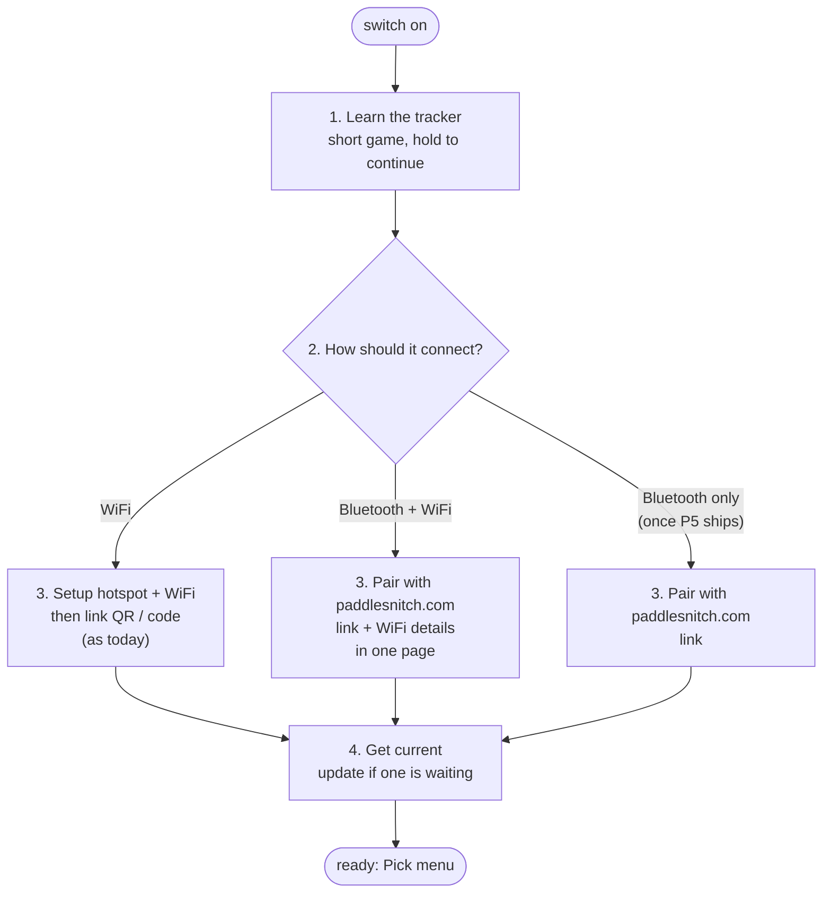

# Feature spec: Bluetooth sync — paddles home by phone, browser or WiFi

**Status:** 📋 spec, not built. Written 2026-10-04.
**Owner:** Baldur (product).
**Related:** [`device-screen-map.md`](device-screen-map.md) (screens, gestures, onboarding),
[`device-uplink.md`](device-uplink.md) (how recordings arrive today),
[`qr-onboarding.md`](qr-onboarding.md) (WiFi + linking),
[`device-ota-and-auth.md`](device-ota-and-auth.md) (device tokens),
[`unified-app-and-api.md`](unified-app-and-api.md) (the API a mobile app would use),
`firmware/src/tutorial.cpp` (the gesture lesson this builds on).

---

## Summary

Today a tracker gets its recordings home one way: it joins WiFi and uploads them
itself. That works at home and fails at a boathouse with no WiFi, which is where
paddles end.

This adds a second way home: **the tracker hands its recordings to its owner's
phone or browser over Bluetooth, and that uploads them.** WiFi stays. Both run
side by side, and whichever gets there first wins.

It also makes first-time setup a guided path: learn the button through a short
game, choose WiFi, Bluetooth or both, get linked to paddlesnitch.com in one
short step, and finish on the current firmware. Either connection can be added
or changed later in Settings. Trackers already in use get Bluetooth by a normal
update and switch it on there.

Without WiFi, a tracker also needs another way to get **firmware updates**. The
phone or browser can carry those too, but only once firmware is signed: see
"Updates without WiFi".

And it compresses recordings first, which makes every route faster, WiFi
included.

## Goals

1. A paddle reaches **Paddles** without WiFi at the place it ended.
2. With the phone app, that happens **without the paddler doing anything**.
3. First-time setup teaches the tracker properly and ends with sync chosen
   and working.
4. Recordings are never lost on the way: the tracker deletes nothing and marks
   nothing sent until the server has it.
5. A tracker only ever talks to its owner's phone or browser. These files are
   someone's location history.
6. A tracker that never sees WiFi can still be set up, linked and kept up to
   date.
7. Trackers already in use can turn Bluetooth on without a cable or a reset.

## Not in scope

- Replacing WiFi upload. It stays the default, automatic route.
- An iPhone app in the first phases (see Platforms).
- Live data on the phone while paddling. Possible later on the same
  connection; not designed here.

---

## Platforms

Bluetooth from a web page ("Web Bluetooth") works in some browsers and not
others. This is from general knowledge, not checked against 2026 releases;
**confirm before P4.**

| Where | Bluetooth from paddlesnitch.com | Route |
|---|---|---|
| Windows, Mac, Linux, ChromeOS: Chrome or Edge | Yes | Web, no app |
| Mac Safari, Firefox anywhere | No | "Use Chrome or Edge" |
| Android: Chrome | Yes, while the page is open | Web now, app later |
| iPhone / iPad, any browser | No (Apple does not allow it) | App only; WiFi meanwhile |

A web page only transfers **while it is open and on screen**. Automatic sync in
the background needs a native app. Order: prove it on the web, then build the
Android app, then the iPhone app if testers need it.

**Android in Chrome is the main test platform until there is an app** (the
owner's decision, 2026-10-04: no app until the browser route works). What to
expect and check in P4:

- **The page must stay open with the screen on.** A transfer pauses if the
  phone locks or the user switches apps, and resumes at the next sync. The page
  keeps the screen awake while syncing (Screen Wake Lock API).
- **Every connection starts with a tap** (CONNECT, SYNC): Chrome only searches
  for devices after a user gesture, and shows its own list of nearby trackers.
- **Permissions:** Android asks for "Nearby devices" (location on Android 11
  and older) the first time. The page explains why before asking.
- **Pairing:** number comparison should appear as Android's normal pairing
  prompt. Confirm this early: if it misbehaves, the pairing design changes.
- **Browser check:** target Chrome. Samsung Internet and Edge share the engine
  but may not support Bluetooth; the page detects missing support and says
  "Open this in Chrome".

---

## User journeys

### J1. First-time setup

The order: **learn the button, choose how it connects, get linked, get
current.** The lesson needs no network, and the choice that follows needs the
button, so the lesson comes first.

**1. Learn the tracker.** The gesture lesson moves to the very start, before
any network setup (today it runs only once the tracker has WiFi and is linked).
It becomes a short game:

- **Level 1: the button.** Today's lesson: tap to move, hold to select,
  double-tap to go back.
- **Level 2: recording.** A practice Track screen with made-up speed and stroke
  rate. Tap to change the unit, hold to stop, double-tap to keep going. It
  explains that recording starts by itself once the tracker has GPS.
- **Level 3: getting paddles home.** A practice Sync screen: what "on tracker /
  uploaded / waiting" mean, and tap to sync now.
- Progress dots ("level 2 of 3"), a short "nice" between levels, nothing scored
  or timed. Wrong gestures flash the prompt rather than failing you, as now.
- The last screen is **Continue: hold**, which is the gesture just learned,
  used for real.
- Replayable from Settings → How to use, as now. A factory reset starts here
  again, as it does today.

**2. How should it connect?** A chooser on the tracker, after the lesson:

| Choice | Best for | Needs |
|---|---|---|
| **WiFi** | WiFi at home; any phone, including iPhone without the app | A phone to join the setup hotspot |
| **Bluetooth + WiFi** | Most people: quickest setup, and paddles come home either way | Chrome or Edge (desktop or Android), or the app |
| **Bluetooth only** | No WiFi anywhere, or none wanted | The same; **only offered once Bluetooth updates exist (P5)** |

Bluetooth only waits for P5 because a tracker with no WiFi and no Bluetooth
updates could only ever be updated by cable. Until then the chooser shows two
rows.

**3. Link to paddlesnitch.com quickly.** This is the step people abandon, so
each route keeps it short:

- **WiFi:** today's flow, unchanged. Setup hotspot, join QR, choose network,
  then the full-screen link QR (scan → /devices with the code filled in) or
  type the 6 characters.
- **Bluetooth + WiFi:** the tracker shows "Go to paddlesnitch.com/devices on
  this computer or phone". There, signed in:
  1. **ADD A TRACKER → SET UP OVER BLUETOOTH**, pick `PT-xxx` from the
     browser's list.
  2. Both show a 6-digit number; **hold** on the tracker to confirm.
  3. The tracker is **linked** at once (see "Linking over Bluetooth"). No code
     to type and no timer.
  4. The same page asks for the **WiFi name and password** and sends them over
     the encrypted Bluetooth connection. **No setup hotspot, no captive portal.**
     The tracker tries them and the page shows whether they worked.
- **Bluetooth only:** steps 1–3, without the WiFi details.

**4. Get current.** A tracker can sit in a box for months, so setup ends by
bringing it up to date:

- **WiFi:** the tracker checks for an update as part of its first sync, as it
  does on every sync.
- **Bluetooth:** the page compares the tracker's version with the current one
  and, if there's an update, offers **UPDATE NOW** before saying "Ready". It
  takes a minute or two with the page open. It can be skipped; the next sync
  offers it again.

**Changing it later.** Settings has a row each for **WiFi** and **Bluetooth**.
Either can be added, changed or turned off, so someone who chose Bluetooth only
can add WiFi later, and the other way round. The tracker won't let both be
turned off, because then nothing could ever reach it. Trackers in use today get
the Bluetooth row by an update (J9).

### J2. Pair with a browser (Chrome or Edge, desktop or Android)

1. On **/devices/<tracker>**, the paddler presses **CONNECT OVER BLUETOOTH**.
   The browser lists nearby trackers by their name (`PT-xxx`, the hotspot name
   they already know).
2. The paddler picks theirs. The tracker shows a 6-digit number; the browser
   (or the operating system) shows the same one. The paddler **holds the button
   to confirm** on the tracker. Same gesture as anywhere else.
3. The tracker remembers that pairing. The page shows "Connected" and what is
   waiting to upload.

The pairing check also proves the tracker belongs to this account: the page
only offers trackers linked to the signed-in user, and the tracker confirms its
id over the connection before any file moves.

### J3. Pair with the phone app (later phases)

Same as J2, started from the app's "Add tracker". On Android the app registers
as the tracker's companion app, which lets the phone wake it when the tracker is
nearby (J5).

### J4. Sync from a browser, by hand

1. Paddler gets home, opens /devices/<tracker>, presses **SYNC OVER BLUETOOTH**.
2. Progress per recording ("Paddle 13:05 — 0.6 of 1.0 MB"), then each one
   appears in Paddles.
3. Closing the page mid-transfer loses nothing: the next sync carries on where
   it stopped.

### J5. Automatic sync with the phone app

1. The paddler stops recording and walks off with the phone in their pocket.
2. The tracker has unsent recordings, so it advertises "tracker PT-xxx, 2 waiting".
3. The phone notices its paired tracker, wakes the app, pulls the recordings and
   uploads them, now or later when it has signal.
4. A notification: "1 paddle added". Tap → the paddle.

No button pressed and no app opened. This is the experience worth building an
app for.

### J6. WiFi and Bluetooth both set up

Whichever route reaches the server first wins. The server already ignores a
second copy of the same recording (it recognises uploads by tracker and
filename), so a recording uploaded twice is harmless.

### J7. Something goes wrong

| What happens | What the paddler sees | Why nothing is lost |
|---|---|---|
| Phone walks out of range mid-transfer | Nothing; it finishes next time | Transfers resume from where they stopped |
| Phone has no signal | "1 paddle waiting to upload" in the app | The app keeps it until it can upload |
| Phone dies after the transfer, before the upload | Next sync sends it again | The tracker only marks it sent when the server confirms |
| Someone else's phone tries to connect | Their phone can't pair | Pairing needs a hold on the tracker; files need a pairing |

### J8. Changing phone, giving the tracker away

- **New phone:** Settings → Bluetooth → Forget phones, then pair again.
- **Factory reset** forgets every pairing, along with WiFi and the account link.
- **Removing the tracker on the website** stops uploads from it. The tracker
  forgets its pairings at its next sync over WiFi or Bluetooth.

### J9. Turn on Bluetooth on a tracker already in use

Every tracker in use today has WiFi, so it gets the Bluetooth firmware the
normal way: an over-the-air update on its next sync.

1. After the update the tracker shows its one-line release note: "New: sync by
   phone or computer. Settings → Bluetooth".
2. **Bluetooth is off after the update.** An update shouldn't switch on a radio
   nobody asked for, or change battery life by surprise.
3. **Settings → Bluetooth** is a new row. Its screen shows Off / On and the
   paired phones and computers. **Hold** turns it on and starts pairing (J2 or
   J3). A second page (tap) has Forget all, behind a confirmation, like the
   Sync screen's cleanup page.
4. /devices notices the new firmware and says the same thing: "Your tracker can
   now sync over Bluetooth. Turn it on in Settings → Bluetooth."

Turning Bluetooth on does not repeat the setup lesson; the lesson's new levels
are in Settings → How to use for anyone curious.

Trackers set up from new (J1) have Bluetooth on if step 2 chose a Bluetooth
option, and off if it chose WiFi. Settings → Bluetooth changes it either way.

### J10. Set up without WiFi

Now part of J1: choose **Bluetooth only** (once P5 ships) or **Bluetooth +
WiFi** at step 2. How the tracker is linked without reaching the server is under
"Linking over Bluetooth" below.

### J11. Update a tracker without WiFi

1. The phone or browser reads the tracker's firmware version when it connects,
   and the server says what the current version is.
2. **Browser:** /devices/<tracker> shows "Update available" and **UPDATE OVER
   BLUETOOTH**. It takes a minute or two with the page open; closing it
   resumes next time.
3. **App:** the update is carried automatically, like recordings, preferably
   while the tracker is charging.
4. The tracker checks the update is genuine (see "Updates without WiFi"),
   installs it, restarts, and the phone or browser confirms it with the server.
5. If the new version fails to start, the tracker goes back to the old one by
   itself, as WiFi updates already do.

The tracker never updates while recording, and refuses if its battery is low.

---

## Design

### Compression (first, because it helps every route)

Measured 2026-10-04 with ordinary gzip:

| File | Size per hour | Compressed | Ratio |
|---|---|---|---|
| GPS track (1 Hz CSV), 7 real recordings | 0.58–0.82 MB | 0.17–0.24 MB | 3.4–3.6× |
| Motion (the ~12 Hz file that uploads) | ~2.0 MB | ~0.75 MB | 2.7× |
| An hour's paddle in total | ~2.9 MB | ~1.0 MB | ~2.9× |

Compressing each 64 KB upload piece on its own, rather than the whole file at
once, costs only about 2% (motion file: 750 KB as one stream, 768 KB as
separate pieces). So the tracker can compress piece by
piece as it reads the card, with no large buffer and no second copy of the file.

- **Format:** a standard deflate/gzip stream per piece, so the server unpacks
  it with Node's built-in zlib.
- **Checksum:** the existing `sha256` covers the **uncompressed** file, so it
  still proves the server rebuilt exactly what was on the card.
- **Server:** accepts pieces marked compressed, unpacks before assembling.
  Uncompressed uploads keep working, so older firmware isn't affected.
- **Ships to WiFi first.** Same code path, about a third of the upload time and
  data, and it proves the format before Bluetooth depends on it.

### Bluetooth transfer

The tracker offers one Bluetooth service:

| Item | Purpose |
|---|---|
| **About** | tracker id, firmware, number of recordings waiting |
| **List** | the waiting recordings: name, size, checksum |
| **Read** | one recording, from an offset, in compressed pieces; resumable |
| **Done** | the phone or browser reports the server's receipt for a recording |

Expected speed, from general knowledge, **to be measured in P4**: a native
app 50–150 KB/s, a web page 10–40 KB/s. With compression an hour's paddle is
~1 MB, so roughly 10–20 s from an app and 25 s to 2 minutes from a web page.

Firmware constraints that already bit us and still apply:

- **The SD card and motion sensor share one connection** (`spibus.h`). Card
  reads for Bluetooth take the same lock the WiFi uploader does.
- **No transfers while recording.** Recording owns the card; the tracker
  doesn't advertise during a recording.
- **Space:** the tracker image is about 1.1 MB in a 3.9 MB slot, so a
  Bluetooth stack (a few hundred KB) fits without touching the partition table.
  WiFi and Bluetooth share one radio on this chip, which it supports.

### Who uploads, and how the tracker knows it arrived

Today only the tracker uploads, with its own token. **That token never crosses
Bluetooth**: anyone holding it could upload as the tracker.

Instead the phone or browser uploads **as the signed-in user**:

- A new endpoint, `POST /api/account/devices/{deviceId}/sessions`, takes the
  same chunked upload as the tracker's own endpoint. It checks the signed-in
  user owns that tracker, then hands over to the same code. Same duplicate
  check (tracker + filename), same checksum, same order rule (a recording's
  motion file only after its track).
- The server answers with a **receipt** the tracker can check: a signature over
  the tracker id, filename and checksum, made with a key derived from the
  tracker's token. The server only stores a hash of the token, and the tracker
  can compute the same thing, so the receipt proves the server accepted it
  without the token going anywhere.
- The phone passes the receipt to **Done**. Only then does the tracker mark the
  recording sent, in the same `uploaded.txt` record WiFi uploads use.

### Linking over Bluetooth (J10)

Linking today: the tracker asks the server for a code, the paddler types it on
the website, and the tracker collects a **token** it keeps for every later
request. **The server only ever stores a hash of that token.**

That makes Bluetooth linking clean. **The tracker creates its own token** and
never lets it out:

1. Paired over Bluetooth (number comparison + hold), the tracker generates a
   random token and stores it, as it stores the one it collects today.
2. It sends the signed-in page or app its **tracker id and the token's hash**.
3. The page or app calls a new account endpoint, `POST
   /api/account/devices/link-bluetooth`, with those two values. The server
   applies the same rules as linking by code: a tracker already on another
   account can't be taken (`owned_elsewhere`), and the same rate limits apply.
4. The server stores the hash, exactly as it would have after code linking.
   From then on the tracker is indistinguishable from one linked by code. If it
   ever reaches WiFi it uploads with its own token as usual.

What proves the tracker belongs to this person is physical: pairing needs a
hold on the tracker in their hand. That's the same trust as today, where the
code is read off the tracker's screen.

### WiFi details over Bluetooth (J1 step 3)

With **Bluetooth + WiFi**, the browser sends the WiFi name and password over
the paired, encrypted connection, so the setup hotspot isn't needed. This is
the same idea as the open "Improv WiFi" standard; use it if it fits, or a small
item on the tracker's own service.

- **Only after pairing.** The WiFi item can't be written on an unpaired
  connection.
- **The tracker tries the network and reports back:** joined, wrong password,
  or network not found. The page shows the result and lets the paddler fix it,
  instead of today's reboot-and-hope.
- **The same rules as the setup page:** no blank password unless the network
  is open, and the "has worked once" mark only once it has really joined (the
  0.16.4 fix).
- **The setup hotspot stays** for the WiFi choice, and for iPhone users without
  the app.

### Updates without WiFi (J11)

**Why today's updates can't simply be relayed:** a tracker updating over WiFi
downloads the image itself over HTTPS, and checks it against a checksum it also
got over HTTPS. Its trust rests on that secure connection. When a phone carries
the update, the secure connection ends at the phone, so a lost, hacked or
malicious phone could hand the tracker any image with a matching checksum.

**So Bluetooth updates require signed firmware first.** That's decision 5 in
[`security-audit-2026-09.md`](security-audit-2026-09.md), which recommends
**ed25519 signing**: a public key built into the firmware, the private key held
outside AWS, about a day of work, and deliverable over the air. It also closes
the audit's wider gap: today anyone who can write the firmware bucket can ship
firmware to every tracker.

The design:

- **The release signs a small manifest:** model, version, size, the image's
  sha256, and a release time. The tracker checks the signature with its built-in
  key, then checks the image against the sha256 as it does now. Who carried it
  (WiFi, phone, browser) no longer matters.
- **WiFi updates check the signature too** once it exists, so there is one rule.
- **No going backwards by replay.** An old signed manifest is still validly
  signed, so a phone could replay an older, flawed version. The tracker
  remembers the release time of the last manifest it accepted and refuses
  older ones. Today's rollback lever (promoting an older build) keeps working
  by signing a new manifest for the older image with a newer release time.
- **Transfer:** the image goes over the same resumable, compressed pieces as
  recordings, written straight into the spare app slot like a WiFi update. It's
  about 1.1 MB, so roughly 15–60 s from an app and 1–2 minutes from a browser
  (estimates until measured).
- **Marking the update good:** the audit also asks that a new version only be
  marked good after it has reached the server, not just booted (audit 5(i)).
  Without WiFi, the server's **receipt** (below) relayed by the phone counts as
  reaching the server.
- **Guards:** not while recording, not below a battery level (to be chosen), and
  the existing roll-back-after-failed-boots still applies.
- **Getting the first Bluetooth firmware onto trackers:** every tracker in use
  has WiFi, so they get it by WiFi. New trackers get it by cable at first flash,
  as now. The partition table doesn't change.

### Trackers that never see WiFi

The server learns a tracker's firmware, model and last-seen time from the
tracker's own requests (`touchDevice`, the `DeviceSeen` metric). A tracker
synced only by phone makes none. So the account upload endpoint takes the
tracker's About details from the phone and records them the same way, so
/devices and the firmware dashboard still show it correctly. Removing a tracker
on the website reaches it the same way: the phone passes it on at the next
connection.

### Pairing and privacy

- **Pairing needs the tracker in hand:** both sides show a 6-digit number and
  the owner holds the button to confirm (Bluetooth "secure connections" with
  number comparison).
- **Files are readable only over a paired, encrypted connection.** The About
  item can be readable before pairing; List and Read cannot.
- **Advertising says little:** the `PT-xxx` name (already public on the setup
  hotspot) and whether recordings are waiting. Never the owner, never a
  location.
- **The tracker keeps at most a few pairings** (a phone and a computer, say).
  Settings → Bluetooth lists and forgets them; a factory reset clears them all.

### Battery

- Advertise only when recordings are waiting and the tracker isn't recording.
- Stop advertising some hours after the last recording ends (to be chosen once
  measured), and start again at the next.
- Measure the cost in P4. Advertising every second or so should be small
  next to the GPS, but that is an estimate, not a measurement.

### Later: working things out on the tracker

Stroke rate and boat motion are calculated on the server today
(`deriveCadence`, `deriveAttitude`). Doing some of it on the tracker would
allow:

- **Live stroke rate on the Track screen**, where it shows `--` today.
- **Smaller transfers**, if summaries ever replace raw motion data.

Rules for when this happens:

- **The server stays the source of truth** while raw data is still uploaded.
- An on-tracker version must match the server on the reference capture
  (`~/Documents/paddlesnitch-tracker-capture-2026-09-13/`) before it's shown to
  anyone.
- Stopping raw motion uploads would be a separate decision. It throws away the
  data that lets us improve the server's maths later.

---

## Phases

| Phase | What | Proves |
|---|---|---|
| **P1. Compression** | Tracker compresses upload pieces; server accepts them. WiFi only. | The format, and a ~3× smaller upload today |
| **P2. Lesson first** | The game-style lesson moves to the start of setup (J1 step 1); WiFi setup follows as today | People learn the button before they need it. Firmware only; can ship any time |
| **P3. Signed firmware** | ed25519-signed manifests, checked on every update; replay protection (audit decision 5) | Updates are genuine whoever carries them |
| **P4. Bluetooth + browser prototype** | Tracker Bluetooth service, pairing, Settings rows for **WiFi** and **Bluetooth** (J9), a test page on /devices that lists and reads recordings | Real speed, battery cost, pairing on Chrome/Edge |
| **P5. Setup, sync and updates from the browser** | The connection chooser (J1 step 2); linking and WiFi details over Bluetooth (step 3); account upload endpoint and receipts (J4); updates over Bluetooth (J11, step 4); then the **Bluetooth only** row | No WiFi anywhere: set up, paddle arrives, tracker stays current |
| **P6. Android app** | Expo app with pairing, linking, automatic sync and updates (J3, J5) | Sync with nothing pressed |
| **P7. iPhone app** | If testers need it | Same, on iPhone |
| **P8. On the tracker** | Live stroke rate; later maybe summaries | Matches the server on the reference capture |

**Order constraints:**
- **Updates over Bluetooth ship in the same phase as Bluetooth setup (P5),** and
  Bluetooth only is the last thing switched on in it. No tracker should ever
  rely on Bluetooth without a way to update over it.
- **P3 (signing) comes before P5,** because a relayed update is only safe if
  it's signed.
- **P4 reaches trackers in use by an ordinary WiFi update.** That works because
  they all have WiFi today, so ship it while that's still true.
- **P2 has no dependencies** and is the cheapest visible improvement.

## Success measures

- Time from the end of a paddle to it appearing in Paddles, by route.
- Share of recordings arriving by WiFi, browser and app.
- Measured transfer speed and battery cost (P4), against the estimates above.
- From testers: how many finish setup, and how many get stuck at each step.

## Open questions

1. **Expo or fully native for the apps?** Expo keeps one codebase with the web
   and fits the planned mobile client, but background Bluetooth needs a custom
   build, not the Expo Go test app.
2. **How long to advertise** after a paddle (battery against convenience).
   Decide from P4 measurements.
3. **Desktop demand.** Will people bring the tracker to a computer, or is the
   browser route mainly a stepping stone to the app? The P5 numbers will tell.
4. **Exact receipt format and key derivation.** Settle in P5, with a host test
   on the tracker side like the other `*_policy` code. The receipt key is
   derived from the stored token hash, so a leaked hash would let someone
   forge receipts: the worst case is a recording marked sent that never
   arrived. Decide whether that needs a separate key.
5. **Where the firmware signing key lives.** The audit suggests a GitHub secret
   on a protected environment, or offline. Offline is safer but slows every
   release, and releases happen on every merge today.
6. **Minimum battery for an update** over Bluetooth, and whether the app should
   only update while the tracker is charging.
