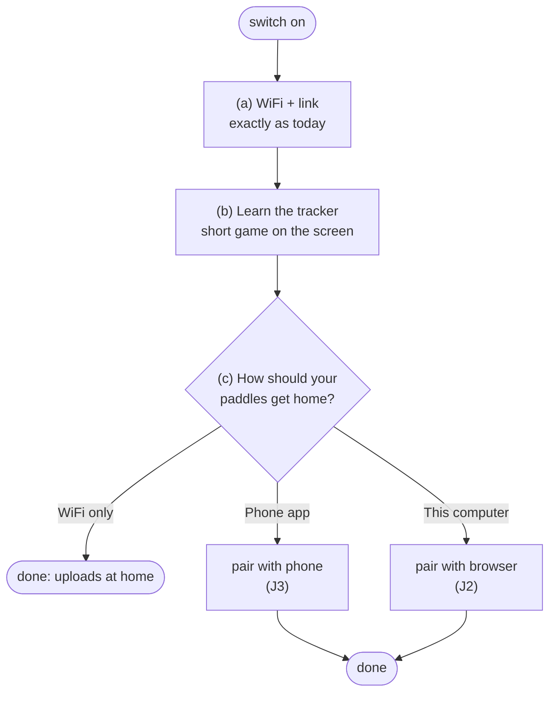

# Feature spec: Bluetooth sync — paddles home by phone, browser or WiFi

**Status:** 📋 spec, not built. Written 2026-10-04.
**Owner:** Baldur (product).
**Related:** [`device-screen-map.md`](device-screen-map.md) (screens, gestures, onboarding),
[`device-uplink.md`](device-uplink.md) (how recordings arrive today),
[`qr-onboarding.md`](qr-onboarding.md) (WiFi + linking),
[`device-ota-and-auth.md`](device-ota-and-auth.md) (device tokens),
[`unified-app-and-api.md`](unified-app-and-api.md) (the API a mobile app would use),
`firmware/src/tutorial.cpp` (the gesture lesson this builds on).

---

## Summary

Today a tracker gets its recordings home one way: it joins WiFi and uploads them
itself. That works at home and fails at a boathouse with no WiFi, which is where
paddles end.

This adds a second way home: **the tracker hands its recordings to its owner's
phone or browser over Bluetooth, and that uploads them.** WiFi stays. Both run
side by side, and whichever gets there first wins.

It also makes first-time setup a guided path: connect WiFi and link the tracker
(as today), learn the button through a short game, then choose how paddles
should get home.

And it compresses recordings first, which makes every route faster, WiFi
included.

## Goals

1. A paddle reaches **Paddles** without WiFi at the place it ended.
2. With the phone app, that happens **without the paddler doing anything**.
3. First-time setup teaches the tracker properly and ends with sync chosen
   and working.
4. Recordings are never lost on the way: the tracker deletes nothing and marks
   nothing sent until the server has it.
5. A tracker only ever talks to its owner's phone or browser. These files are
   someone's location history.

## Not in scope

- Replacing WiFi upload. It stays the default, automatic route.
- An iPhone app in the first phases (see Platforms).
- Live data on the phone while paddling. Possible later on the same
  connection; not designed here.

---

## Platforms

Bluetooth from a web page ("Web Bluetooth") works in some browsers and not
others. This is from general knowledge, not checked against 2026 releases;
**confirm before Phase 2.**

| Where | Bluetooth from paddlesnitch.com | Route |
|---|---|---|
| Windows, Mac, Linux, ChromeOS: Chrome or Edge | Yes | Web, no app |
| Mac Safari, Firefox anywhere | No | "Use Chrome or Edge" |
| Android: Chrome | Yes, while the page is open | Web now, app later |
| iPhone / iPad, any browser | No (Apple does not allow it) | App only; WiFi meanwhile |

A web page only transfers **while it is open and on screen**. Automatic sync in
the background needs a native app. Order: prove it on the web, then build the
Android app, then the iPhone app if testers need it.

---

## User journeys

### J1. First-time setup

**(a) WiFi and linking: unchanged.** Setup hotspot, join QR, choose network,
then the link QR or code entered on paddlesnitch.com. See
[`device-screen-map.md`](device-screen-map.md) § Onboarding.

**(b) Learn the tracker, game-style.** The current gesture lesson already runs
here (it starts once the tracker has WiFi and is linked). It teaches tap, hold
and double-tap. Extend it into a short game:

- **Level 1: the button.** Today's lesson: tap to move, hold to select,
  double-tap to go back.
- **Level 2: recording.** A practice Track screen with made-up speed and stroke
  rate. Tap to change the unit, hold to stop, double-tap to keep going. It
  explains that recording starts by itself once the tracker has GPS.
- **Level 3: getting paddles home.** A practice Sync screen: what "on tracker /
  uploaded / waiting" mean, and tap to sync now.
- Progress dots at the top ("level 2 of 3"), a short "nice" between levels, and
  nothing scored or timed. Wrong gestures flash the prompt rather than failing
  you, as now.
- Skippable (double-tap out of level 1), and replayable from
  Settings → How to use, as now.

**(c) How should your paddles get home?** A new chooser on the tracker:

- **WiFi only.** Today's behaviour. Done.
- **Phone app.** Shows "Open the paddlesnitch app" and starts pairing (J3).
  Only offered once an app exists. Until then this row isn't shown.
- **This computer.** Shows "Open paddlesnitch.com/devices on this computer" and
  starts pairing (J2).

The choice isn't final. Settings → Bluetooth lets you add or remove a phone or
browser later, and WiFi keeps working whatever you pick.

### J2. Pair with a browser (Chrome or Edge, desktop or Android)

1. On **/devices/<tracker>**, the paddler presses **CONNECT OVER BLUETOOTH**.
   The browser lists nearby trackers by their name (`PT-xxx`, the hotspot name
   they already know).
2. The paddler picks theirs. The tracker shows a 6-digit number; the browser
   (or the operating system) shows the same one. The paddler **holds the button
   to confirm** on the tracker. Same gesture as anywhere else.
3. The tracker remembers that pairing. The page shows "Connected" and what is
   waiting to upload.

The pairing check also proves the tracker belongs to this account: the page
only offers trackers linked to the signed-in user, and the tracker confirms its
id over the connection before any file moves.

### J3. Pair with the phone app (later phases)

Same as J2, started from the app's "Add tracker". On Android the app registers
as the tracker's companion app, which lets the phone wake it when the tracker is
nearby (J5).

### J4. Sync from a browser, by hand

1. Paddler gets home, opens /devices/<tracker>, presses **SYNC OVER BLUETOOTH**.
2. Progress per recording ("Paddle 13:05 — 0.6 of 1.0 MB"), then each one
   appears in Paddles.
3. Closing the page mid-transfer loses nothing: the next sync carries on where
   it stopped.

### J5. Automatic sync with the phone app

1. The paddler stops recording and walks off with the phone in their pocket.
2. The tracker has unsent recordings, so it advertises "tracker PT-xxx, 2 waiting".
3. The phone notices its paired tracker, wakes the app, pulls the recordings and
   uploads them, now or later when it has signal.
4. A notification: "1 paddle added". Tap → the paddle.

No button pressed and no app opened. This is the experience worth building an
app for.

### J6. WiFi and Bluetooth both set up

Whichever route reaches the server first wins. The server already ignores a
second copy of the same recording (it recognises uploads by tracker and
filename), so a recording uploaded twice is harmless.

### J7. Something goes wrong

| What happens | What the paddler sees | Why nothing is lost |
|---|---|---|
| Phone walks out of range mid-transfer | Nothing; it finishes next time | Transfers resume from where they stopped |
| Phone has no signal | "1 paddle waiting to upload" in the app | The app keeps it until it can upload |
| Phone dies after the transfer, before the upload | Next sync sends it again | The tracker only marks it sent when the server confirms |
| Someone else's phone tries to connect | Their phone can't pair | Pairing needs a hold on the tracker; files need a pairing |

### J8. Changing phone, giving the tracker away

- **New phone:** Settings → Bluetooth → Forget phones, then pair again.
- **Factory reset** forgets every pairing, along with WiFi and the account link.
- **Removing the tracker on the website** stops uploads from it. The tracker
  forgets its pairings at its next sync over WiFi or Bluetooth.

---

## Design

### Compression (first, because it helps every route)

Measured 2026-10-04 with ordinary gzip:

| File | Size per hour | Compressed | Ratio |
|---|---|---|---|
| GPS track (1 Hz CSV), 7 real recordings | 0.58–0.82 MB | 0.17–0.24 MB | 3.4–3.6× |
| Motion (the ~12 Hz file that uploads) | ~2.0 MB | ~0.75 MB | 2.7× |
| An hour's paddle in total | ~2.9 MB | ~1.0 MB | ~2.9× |

Compressing each 64 KB upload piece on its own, rather than the whole file at
once, costs only about 2% (motion file: 750 KB as one stream, 768 KB as
separate pieces). So the tracker can compress piece by
piece as it reads the card, with no large buffer and no second copy of the file.

- **Format:** a standard deflate/gzip stream per piece, so the server unpacks
  it with Node's built-in zlib.
- **Checksum:** the existing `sha256` covers the **uncompressed** file, so it
  still proves the server rebuilt exactly what was on the card.
- **Server:** accepts pieces marked compressed, unpacks before assembling.
  Uncompressed uploads keep working, so older firmware isn't affected.
- **Ships to WiFi first.** Same code path, about a third of the upload time and
  data, and it proves the format before Bluetooth depends on it.

### Bluetooth transfer

The tracker offers one Bluetooth service:

| Item | Purpose |
|---|---|
| **About** | tracker id, firmware, number of recordings waiting |
| **List** | the waiting recordings: name, size, checksum |
| **Read** | one recording, from an offset, in compressed pieces; resumable |
| **Done** | the phone or browser reports the server's receipt for a recording |

Expected speed, from general knowledge, **to be measured in Phase 2**: a native
app 50–150 KB/s, a web page 10–40 KB/s. With compression an hour's paddle is
~1 MB, so roughly 10–20 s from an app and 25 s to 2 minutes from a web page.

Firmware constraints that already bit us and still apply:

- **The SD card and motion sensor share one connection** (`spibus.h`). Card
  reads for Bluetooth take the same lock the WiFi uploader does.
- **No transfers while recording.** Recording owns the card; the tracker
  doesn't advertise during a recording.
- **Space:** the tracker image is about 1.1 MB in a 3.9 MB slot, so a
  Bluetooth stack (a few hundred KB) fits without touching the partition table.
  WiFi and Bluetooth share one radio on this chip, which it supports.

### Who uploads, and how the tracker knows it arrived

Today only the tracker uploads, with its own token. **That token never crosses
Bluetooth**: anyone holding it could upload as the tracker.

Instead the phone or browser uploads **as the signed-in user**:

- A new endpoint, `POST /api/account/devices/{deviceId}/sessions`, takes the
  same chunked upload as the tracker's own endpoint. It checks the signed-in
  user owns that tracker, then hands over to the same code. Same duplicate
  check (tracker + filename), same checksum, same order rule (a recording's
  motion file only after its track).
- The server answers with a **receipt** the tracker can check: a signature over
  the tracker id, filename and checksum, made with a key derived from the
  tracker's token. The server only stores a hash of the token, and the tracker
  can compute the same thing, so the receipt proves the server accepted it
  without the token going anywhere.
- The phone passes the receipt to **Done**. Only then does the tracker mark the
  recording sent, in the same `uploaded.txt` record WiFi uploads use.

### Pairing and privacy

- **Pairing needs the tracker in hand:** both sides show a 6-digit number and
  the owner holds the button to confirm (Bluetooth "secure connections" with
  number comparison).
- **Files are readable only over a paired, encrypted connection.** The About
  item can be readable before pairing; List and Read cannot.
- **Advertising says little:** the `PT-xxx` name (already public on the setup
  hotspot) and whether recordings are waiting. Never the owner, never a
  location.
- **The tracker keeps at most a few pairings** (a phone and a computer, say).
  Settings → Bluetooth lists and forgets them; a factory reset clears them all.

### Battery

- Advertise only when recordings are waiting and the tracker isn't recording.
- Stop advertising some hours after the last recording ends (to be chosen once
  measured), and start again at the next.
- Measure the cost in Phase 2. Advertising every second or so should be small
  next to the GPS, but that is an estimate, not a measurement.

### Later: working things out on the tracker

Stroke rate and boat motion are calculated on the server today
(`deriveCadence`, `deriveAttitude`). Doing some of it on the tracker would
allow:

- **Live stroke rate on the Track screen**, where it shows `--` today.
- **Smaller transfers**, if summaries ever replace raw motion data.

Rules for when this happens:

- **The server stays the source of truth** while raw data is still uploaded.
- An on-tracker version must match the server on the reference capture
  (`~/Documents/paddlesnitch-tracker-capture-2026-09-13/`) before it's shown to
  anyone.
- Stopping raw motion uploads would be a separate decision. It throws away the
  data that lets us improve the server's maths later.

---

## Phases

| Phase | What | Proves |
|---|---|---|
| **P1. Compression** | Tracker compresses upload pieces; server accepts them. WiFi only. | The format, and a ~3× smaller upload today |
| **P2. Bluetooth + browser prototype** | Tracker Bluetooth service, pairing, a test page on /devices that lists and reads recordings | Real speed, battery cost, pairing on Chrome/Edge |
| **P3. Upload from the browser** | Account upload endpoint, receipts, J2 + J4 for real | End-to-end: no WiFi, paddle arrives |
| **P4. Guided setup** | The game-style lesson (J1 b) and the "how should paddles get home?" chooser (J1 c) | Setup ends with sync chosen and working |
| **P5. Android app** | Expo app with pairing and automatic sync (J3, J5) | Sync with nothing pressed |
| **P6. iPhone app** | If testers need it | Same, on iPhone |
| **P7. On the tracker** | Live stroke rate; later maybe summaries | Matches the server on the reference capture |

P4 doesn't depend on P2–P3 except for the chooser's "This computer" row, so the
game-style lesson can ship earlier if wanted.

## Success measures

- Time from the end of a paddle to it appearing in Paddles, by route.
- Share of recordings arriving by WiFi, browser and app.
- Measured transfer speed and battery cost (P2), against the estimates above.
- From testers: how many finish setup, and how many get stuck at each step.

## Open questions

1. **No WiFi at all.** Setup (a) needs WiFi to link the tracker. A paddler with
   no WiFi anywhere can't start. Should the phone or browser also be able to
   do the linking over Bluetooth? It could, using the same pairing, but it's a
   bigger change to setup.
2. **Expo or fully native for the apps?** Expo keeps one codebase with the web
   and fits the planned mobile client, but background Bluetooth needs a custom
   build, not the Expo Go test app.
3. **How long to advertise** after a paddle (battery against convenience).
   Decide from P2 measurements.
4. **Desktop demand.** Will people bring the tracker to a computer, or is the
   browser route mainly a stepping stone to the app? The P3 numbers will tell.
5. **Exact receipt format and key derivation.** Settle in P3, with a host test
   on the tracker side like the other `*_policy` code.
